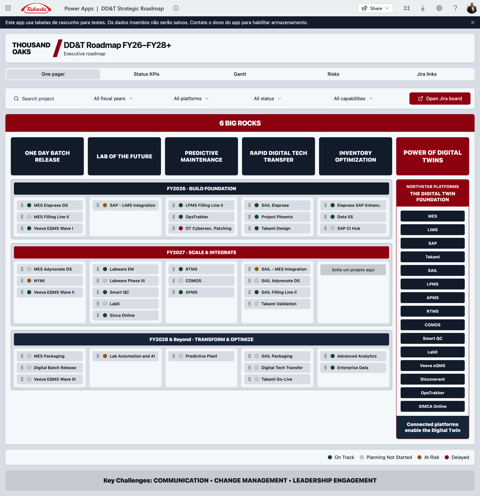

# GSQ GML DD&T Roadmap Executive Platform

## Business Design Package — Functional Blueprint

| Field | Value |
| --- | --- |
| Product | GSQ DD&T Roadmap Executive Platform (Single Pane of Glass) |
| Document type | Business Design Package / functional specification |
| Version | 1.3 |
| Date | 4 September 2026 |
| Executive sponsor | Joel Vincent |
| Business sponsor / product lead | Dean Santoro |
| Owning organization | Global Manufacturing & Labs DD&T |
| Companion documents | *GSQ DD&T Roadmap Executive Platform MVP v2 Sept 2026* (business case); *Executive Summary*; *TakOS Onboarding Readiness* |
| Intended readers | Funding approvers, TakOS / Power Platform delivery team, site heads, PMO |
| Status | Ready for funding package; not a controlled Veeva record |

This package is the functional specification the delivery team should implement against. It is written so a developer or TakOS POD should not need to invent business process, navigation, KPI definitions, or executive-reporting behavior.

---

## 1. Purpose of this blueprint

Leadership currently prepares business reviews by stitching Jira boards, SPOT investment views, site Power Apps, Power BI trackers, and PowerPoint. The Executive Platform is a **single portal of truth**: one site-aware shell that presents the 1,000-foot portfolio, then drills into the detailed views that already exist, plus the Budget and Site Head input that are missing today.

This document defines:

1. What executives and site heads see in each connected view.
2. How drill-down works from the 1,000-foot Power App into detailed Power Apps, Power BI, Jira, and SPOT.
3. How information is entered versus how it is displayed.
4. The data architecture, integrations, roles, and acceptance criteria.
5. The level of effort and people-hours to design, build, and integrate end to end.

**This blueprint does not build or integrate the dashboards.** It is the specification used with the business-case document to fund a developer resource (TakOS Marketplace and/or Power Platform).

Figures 1–11 are **live source experiences** captured 4 September 2026 — the UX the developer reuses or embeds. Figures 12–15 are **target-state mockups** of the new Executive Platform shell (site selector, full tab set, Business Review, Site input). They are labelled TARGET MOCKUP on the image. They are the visual specification for what Band B builds; they are not a live app.

### Figures in this package

| Figure | What it shows | Used in |
| --- | --- | --- |
| 1 | Thousand Oaks One pager Power App (1,000-foot shell) | §3.1, §7.1 |
| 2 | DD&T MYC Budget 2026 Power App | §3.2, §7.4 |
| 3 | Combined Gantt + Budget Power App (target Gantt tab) | §3.3, §7.3 |
| 4 | Network Global Roadmap (34 programmes / 573 projects) | §3.4, §7.10 |
| 5 | Network Sites roll-up (Americas / APAC / Europe) | §3.4, §7.10 |
| 6 | Network Initiatives roll-up (MES, Paperless, ODBR, …) | §3.4, §7.10 |
| 7 | Network Regions (DD&T reporting lines) | §3.4, §7.10 |
| 8 | Existing Power BI Thousand Oaks Gantt (do not rebuild) | §3.4 |
| 9 | Capability Tracker — plant summary (Lexington) | §3.5, §7.7 |
| 10 | Capability Tracker — all capabilities (Brooklyn Park) | §3.5, §7.7 |
| 11 | Delivery SPOT 1063647 project board | §9.5 |
| 12 | **Target mockup** — One pager in the new Glass (site selector + full tabs) | §6.4, §7.1 |
| 13 | **Target mockup** — Gantt + Budget inside the Glass | §6.4, §7.3 |
| 14 | **Target mockup** — Business Review (new; freeze pack) | §6.4, §7.8 |
| 15 | **Target mockup** — Site input (new write path) | §6.4, §7.9 |

---

## 2. Product hypothesis

If GSQ Manufacturing & Labs leadership can open one site-aware portal that is fed by Jira, SPOT, and EDB, and if site heads can enter the commentary that those systems do not hold, then a business review can run from a maintained system of record instead of a manually assembled deck.

The MVP must prove six things (from the business case):

1. Jira holds enough portfolio and delivery data for executive roadmap reporting.
2. SPOT holds enough investment and project information for executive reporting.
3. EDB holds enough deployment, adoption, utilization, and capability data for value-realization insight.
4. A reusable executive experience can be delivered on approved Takeda platforms (Power Platform for the shell; TakOS for the funded product path).
5. Executives can obtain portfolio status and business-review insight without multiple PowerPoints.
6. The concept creates enough measurable value to justify Releases 1–3.

---

## 3. Current-state inventory (what already exists)

The platform **reuses** these assets as the 1,000-foot experience and as drill-down destinations. They are the UX specification, not disposable sketches.

### 3.1 Thousand Oaks Strategic Roadmap Power App — 1,000-foot view

| Item | Value |
| --- | --- |
| Play URL | `https://apps.powerapps.com/play/e/13ab3896-86ac-e9d1-8a83-257843921f13/app/83afccd8-23f4-4ba1-9416-9059f69cd304` |
| App ID | `83afccd8-23f4-4ba1-9416-9059f69cd304` |
| Environment | `13ab3896-86ac-e9d1-8a83-257843921f13` |
| Tenant | `57fdf63b-7e22-45a3-83dc-d37003163aae` |
| Layout | Tablet, 1920 × 1080 |
| Local recreation / `.msapp` | `~/RoadmapExecutivePlatform` and `takOS/Roadmap Executive Platform` |

**What it already does**

- Header branded **Thousand Oaks** (hard-coded; must become a network site selector).
- Tabs: **One pager · Status KPIs · Gantt · Risks · Jira Links**.
- Filters: search, fiscal year, North Star platform, status, Big Rock / capability.
- **One pager:** six Big Rocks across the top; FY2026 / FY2027 / FY2028+ swimlanes; project cards with status dots; drag-and-drop between year × Big Rock cells.
- **Project sidecar:** owner, description, business value, dependencies, milestones, progress, Jira link, “move project” control.
- **North Star rail:** SAIL, LPMS, APMS, RTMS, COMOS, Smart QC, LabX, Veeva eQMS, Discoverant, OpsTrakker, SIMCA Online (plus MES / SAP on cards).
- Footer: key challenges (Communication · Change Management · Leadership Engagement) and status legend.
- **Open Jira board** action.


**What is wrong or missing for a network portal**

- Site is not a filter. All data is Thousand Oaks sample / draft collections (`colProjects`). Changes do not persist.
- No Budget tab.
- Gantt is year-band only; it is not combined with budget, actuals, or SPOT IDs.
- Status vocabulary does not yet match the global DDT roadmap RAG.
- No Site Head commentary, no audit trail, no role-based edit.

### 3.2 Budget Power App (missing tab — reuse this pattern)

| Item | Value |
| --- | --- |
| Play URL | `https://apps.powerapps.com/play/e/d99720be-f155-e674-86b3-32acc687394e/app/c683f980-1fb1-4917-b70c-34496646e6d3` |
| Environment | `d99720be-f155-e674-86b3-32acc687394e` |

This is the starting visual for the new **Budget** tab: investment vs. forecast vs. actual, by initiative / project / fiscal year, for the selected site. Live title: **DD&T MYC Budget 2026** (Thousand Oaks mid-year cycle). In the Glass, the same layout is filtered by the header site selector.


### 3.3 Combined Budget + Gantt Power App (target Gantt tab)

| Item | Value |
| --- | --- |
| Play URL | `https://apps.powerapps.com/play/e/d99720be-f155-e674-86b3-32acc687394e/app/5d55a550-7d80-469a-84bc-bee2f53a08b3` |

The production **Gantt** tab must look and behave like this app: timeline bars and budget/actuals on the same row, not two disconnected screens. Left = site roadmap by workstream (MES, SAIL, Paperless, …) with SPOT IDs on the bars. Right = the MYC Budget executive panel for the same site.


### 3.4 Global DDT Roadmap (network 1,000-foot evidence)

Prototype URL pattern `100.64.0.2:3000` with tabs Overview · Global Roadmap · Initiatives · Regions · Sites · Data. Snapshot as of 31 Aug 2026:

- 34 programmes · 573 projects · 92 at risk
- Timeline FY24–FY30 with per-site go-lives
- Status glyphs: On Track · Monitor Closely · Leadership Attention Required · Blocked Pending Dependency · No Status · Complete · Cancelled
- Programme health is **rolled up from linked projects** (no authored initiative RAG in the feed)
- Site-led work is a first-class lane (329+ items), not hidden

This is the **network** reading of the same portfolio the site Power App shows for one plant. The Executive Platform must be able to show both: one site (business review) and all sites (GSQ leadership). Clicking a site code (THO, LEX, …) sets the Glass site selector.


### 3.5 Capability Tracker (Power BI) — North Star / EDB-style drill-down

Two screens exist in `Capability Tracker.pdf`:

**Screen A — plant summary (example: Lexington)**

- Filters: Plant, Global Initiative Yes/No
- Capability KPIs: 48 total · 31.96% deployed · 26.21% adopted
- Integration KPIs: 23 total · 47.83% deployed · 45.65% adopted
- Donuts: Fully Deployed & Adopted / Pending / Deployed, Not Fully Adopted
- Bar: capabilities on a global initiative vs. local
- Footer: SAIL deployed plants (Brooklyn Park, Lexington, Linz, Osaka, Thousand Oaks)

**Screen B — all capabilities (example: Brooklyn Park)**

- Site capability score (49.30) and health line: capabilities complete 29/47 · integrations complete 7/19
- Funnel: Total → Fully Deployed → Fully Adopted → Both
- Pending integrations table (e.g. Batch Release: Floor Scales → LabX, LabWare ↔ MES, MES ↔ SAIL, SAP → RTMS, Veeva ↔ SAP)
- Completed capabilities list

This is the **system-integration and adoption** detail that the 1,000-foot roadmap does not show. The Capability tab embeds this report and passes the Glass plant filter.


### 3.6 Jira portfolio already in use

`DDTGMPORT` holds the GSQ initiative set (MES, ODBR, Paperless Operations, Takami, Phoenix, Labware, SAIL, OT Cyber, etc.). Site projects (e.g. `DDTTO-*`, `DDTBP-*`) and SPOT IDs (e.g. TO MES Elaprase DS — SPOT 1024096) already exist. That Jira estate is a **data source**, not the delivery Initiative for *this* platform (see the onboarding companion).

### 3.7 What “single pane of glass” means

```
┌──────────────────────────────────────────────────────────────────────────┐
│  EXECUTIVE GLASS  (one Power App / later TakOS shell)                    │
│  Site selector · FY · Big Rock · Platform · Risk · Role                  │
│                                                                          │
│  [One pager] [KPIs] [Gantt+Budget] [Budget] [Risks] [Jira] [Capability]  │
│  [Business Review] [Site input] [Network roadmap]                        │
│                                                                          │
│     embeds / launches existing Power Apps, Power BI, Jira, SPOT          │
│     writes Site Head commentary to Dataverse (system of record)          │
└──────────────────────────────────────────────────────────────────────────┘
         │                    │                     │
    Jira / DDTGMPORT      SPOT investment        EDB / Capability
    delivery + RAG        $ + milestones         deploy / adopt
```

Executives never leave the portal to “find the other dashboard.” Site context set in the header applies to every tab.

---

## 4. Personas, decisions, and RACI

### 4.1 Personas

| Persona | Primary job in the portal | Typical decision |
| --- | --- | --- |
| GSQ / GML executive (Joel Vincent and peers) | Network 1,000-foot health, investment vs. delivery, which sites need attention | Escalate, re-prioritize, fund, stop |
| Site Head (Thousand Oaks first) | Site portfolio, risks, budget burn, capability adoption, BR narrative | Confirm status, accept risk, ask for help |
| Site DD&T / digital lead (Dean Santoro at TO) | Keep the portal true; own commentary quality; prepare the business review | Correct mapping, unblock data, brief the Site Head |
| Programme / platform owner (MES, SAIL, Labware, …) | Cross-site programme lane, go-lives, dependencies | Sequence sites, resolve cross-site blocks |
| PMO / project manager | Data quality, SPOT IDs, milestone dates, RAID | Close gaps before the review |
| Finance partner | Budget vs. forecast vs. actual, variance | Reallocate, challenge, approve |
| Delivery engineer (TakOS / Power Platform) | Build, integrate, operate | Not a business-review actor |

### 4.2 RACI (MVP)

| Activity | Site Head | Site DD&T lead | Programme owner | PMO | Finance | Executive | Delivery team |
| --- | --- | --- | --- | --- | --- | --- | --- |
| Jira status / dates | I | C | A | R | I | I | I |
| SPOT financials | I | C | C | C | A/R | I | I |
| EDB deploy/adopt | I | C | A | I | I | I | I |
| Site commentary / BR narrative | A | R | C | C | I | I | I |
| Local risk not in Jira | A | R | C | C | I | I | I |
| Big Rock / FY / platform mapping | I | A | C | R | I | I | I |
| Portal configuration / security | I | C | I | I | I | I | A/R |
| Business-review pack freeze | A | R | C | C | C | I | I |

**Rule:** systems of record stay authoritative. The portal does not become a second Jira or a second SPOT. Site Heads write only what those systems cannot hold (narrative, local context, confirmation).

---

## 5. Canonical information architecture

### 5.1 Hierarchy

```
GSQ Network
 └─ Region (Americas / Europe / Asia-Pacific)     ← DD&T reporting line, not geography
     └─ Site (e.g. Thousand Oaks / THO)
         └─ Big Rock (6 strategic capabilities)
             └─ North Star Platform (MES, SAIL, Labware, …)
                 └─ Initiative / Programme (DDTGMPORT-*)
                     └─ Site project (DDTTO-*, SPOT ID)
                         └─ Milestone / go-live
                         └─ Risk / impediment
                         └─ Budget line (SPOT)
                         └─ Capability / integration (EDB)
```

**Reporting-line exception (already in the global roadmap):** Vashi reports into Europe; Yaroslavl reports into Asia-Pacific. The site master must store `reporting_region`, not infer it from country.

### 5.2 Site master (network of 18)

| Region | Site | Code | Notes for MVP |
| --- | --- | --- | --- |
| Americas | Lexington | LEX | Capability Tracker already live |
| Americas | Thousand Oaks | THO | **Business-review pilot** |
| Americas | Brooklyn Park | BRP | Capability Tracker already live |
| Americas | Naucalpan | NAU | |
| Americas | Buenos Aires | BUE | |
| Asia-Pacific | Tianjin | TJN | |
| Asia-Pacific | Osaka | OSA | SAIL deployed |
| Asia-Pacific | Hikari | HIK | |
| Asia-Pacific | Singapore | SGP | |
| Asia-Pacific | Yaroslavl | YAR | Reports to APAC; high site-led share |
| Asia-Pacific | Bekasi | BEK | |
| Europe | Grange Castle | GRA | Largest site-led volume |
| Europe | Bray | BRY | |
| Europe | Linz | LIN | SAIL deployed |
| Europe | Oranienburg | ORA | |
| Europe | Singen | SNG | |
| Europe | Neuchatel | NEU | |
| Europe | Vashi | VAS | Reports to Europe |

Header control: **Site** (required). Optional second control: **Network / All sites** for GSQ executives. Changing Site re-queries every tab; it does not open a different app.

### 5.3 Six Big Rocks (One pager columns)

| ID | Label | Typical North Star platforms |
| --- | --- | --- |
| `one-day-batch-release` | One Day Batch Release | MES, Veeva eQMS, Smart QC, NYMI |
| `lab-of-the-future` | Lab of the Future | Labware (GLIMS/EM), LabX, Smart QC, SIMCA Online |
| `predictive-maintenance` | Predictive Maintenance | LPMS, RTMS, APMS, COMOS, OpsTrakker |
| `rapid-digital-tech-transfer` | Rapid Digital Tech Transfer | SAIL, Takami, Phoenix |
| `inventory-optimization` | Inventory Optimization | SAP, Takami, warehouse / RTMS |
| `digital-twin` | Power of Digital Twins | Discoverant, Enterprise Data, SIMCA, digital twin use cases |

A project belongs to **exactly one** Big Rock for the One pager (primary). It may tag additional platforms.

### 5.4 Canonical status (must map all three current vocabularies)

| Canonical | TO Power App today | Global roadmap | Power BI | Color / glyph |
| --- | --- | --- | --- | --- |
| `on_track` | On Track | On Track | Green | Green circle |
| `monitor` | At Risk (split) | Monitor Closely | Amber | Amber triangle |
| `leadership` | Delayed / At Risk (split) | Leadership Attention Required | Red | Red diamond |
| `blocked` | — | Blocked Pending Dependency | Red | Solid red |
| `planning` | Planning Not Started | No Status Reported (if no RAG) | Unassigned | Grey hollow |
| `complete` | — | Complete | Completed | Blue check |
| `cancelled` | — | Cancelled | — | Grey X |

**Roll-up rule (already proven on the global roadmap, keep it):**

- Initiative RAG = worst open child project (Leadership > Blocked > Monitor > On Track).
- Do not allow an authored initiative RAG that contradicts children.
- Complete and Cancelled are excluded from “active” and “at risk” counts.

### 5.5 Fiscal time

- Fiscal year labels **FY26, FY27, FY28+** on the site One pager.
- Network Gantt may span **FY24–FY30** (global roadmap already does).
- “Today” marker is required on every Gantt.
- A project’s **planning FY** (One pager swimlane) and **date span** (Gantt start / go-live) are different fields. Do not collapse them.

---

## 6. Navigation model

### 6.1 Shell chrome (always visible)

| Control | Behavior |
| --- | --- |
| Takeda mark + product title | “DD&T Executive Platform” |
| **Site selector** | Replaces hard-coded “Thousand Oaks”. Searchable. Shows code + name. |
| Scope toggle | **This site** / **Network** (Network hidden from Site Head role if desired) |
| As-of stamp | Source freshness: Jira, SPOT, EDB, last Site Head save |
| Primary tabs | See 6.2 |
| Search | Project / initiative / SPOT / Jira key |
| Filters | FY, Big Rock, Platform, Risk, Programme vs site-led |
| Identity | Role, site entitlements, “view as” for support only |

### 6.2 Primary tabs (site mode)

| Tab | Source experience | MVP? |
| --- | --- | --- |
| **One pager** | Existing TO Strategic Roadmap One pager | Yes — persist + site-aware |
| **Status KPIs** | Existing Status KPIs tab | Yes — live counts |
| **Gantt + Budget** | Combined Budget+Gantt Power App | Yes — this replaces the thin Gantt |
| **Budget** | Budget Power App | Yes — stand-alone finance view |
| **Risks** | Existing Risks tab + Jira impediments | Yes |
| **Jira** | Jira Links + live issue list | Yes |
| **Capability** | Capability Tracker Power BI | Yes — embed + site filter |
| **Business Review** | New, TO pilot | Yes — assembled from the above |
| **Site input** | New forms | Yes — write path |
| **Network roadmap** | Global DDT Roadmap | Yes for executives; optional for Site Head |

### 6.3 Deep links (do not copy data; pass context)

Every card, bar, and table row must expose:

- `siteCode`
- `jiraKey` and/or `spotId`
- `initiativeKey`
- `tab` + `entityId`

Opening Jira, SPOT, or a child Power BI report **preserves site + entity**. Closing the child returns to the same tab and selection.

### 6.4 Target-state mockups (what Band B builds)

These four screens are the **new platform**, not the current Power Apps. Same Takeda chrome on every tab: product title, **site drop-down** (replaces hard-coded Thousand Oaks), This site / Network, source freshness, and the full tab row. Live apps in Figures 1–3 are the visual DNA; these mockups show how that DNA sits in one Glass.

**What changed versus today**

- Site is a control, not a title.
- Tabs add **Budget**, **Gantt + Budget** (replaces thin Gantt), **Capability**, **Business Review**, **Site input**, **Network**.
- Sidecar actions jump inside the Glass (Gantt + Budget, Capability) instead of forcing a second app hunt.
- Business Review and Site input do not exist in the current Power Apps — they are new.


---

## 7. Screen inventory and view specifications

For every screen: purpose, users, data, rules, drill-downs, entry vs display, acceptance.

### 7.1 One pager — 1,000-foot site roadmap

**Purpose.** In one screen, show how the selected site’s work sits on the six Big Rocks across FY26–FY28+. The live Thousand Oaks shell (Figure 1) is the visual DNA. Figure 12 is the **target**: same grid, site is a drop-down, tabs include Budget / Capability / Business Review / Site input / Network.




**Layout (preserve the current Power App)**

1. Site name (from selector, not a static image).
2. Title: `DD&T Roadmap FY26–FY28+` / subtitle “Executive roadmap”.
3. Pill tabs + filters + **Open Jira board** (board URL is site-specific).
4. Red banner: **6 BIG ROCKS** and six navy tiles.
5. Three year bands (navy / red / navy) with a 6-column grid under each Big Rock.
6. Project cards: grip, status dot, name.
7. Right sidecar for the selected project.
8. North Star platform rail.
9. Footer challenges + legend.

**Data required**

| Field | Source | Display / edit |
| --- | --- | --- |
| Project name | Jira summary | Display |
| Jira key | Jira | Display + link |
| SPOT ID | Jira custom field / SPOT | Display + link |
| Status | Jira + mapping table | Display |
| Big Rock | Mapping table (PMO-maintained) | Edit by Site DD&T / PMO |
| Fiscal swimlane | Mapping table | Edit by Site DD&T / PMO |
| Platform | Jira component / mapping | Display |
| Owner | Jira assignee | Display |
| Description, value, dependencies, milestones | Jira description + sidecar fields in Dataverse if Jira is empty | Display; Site DD&T may enrich in Dataverse |
| Progress % | Jira or calculated from milestones | Display |
| Programme vs site-led | Initiative membership | Display |

**Business rules**

- Cards shown = selected site’s projects only.
- Drag-and-drop **does not write to Jira**. It updates the mapping table (Big Rock × FY) and writes an audit row. Banner: “Layout changes are planning metadata. Jira dates and status remain the system of record.”
- Empty cell copy: “No projects in this Big Rock / year” (English; retire Portuguese draft strings).
- Selecting a North Star chip filters the grid to that platform.

**Drill-down**

| User action | Destination |
| --- | --- |
| Click card | Sidecar (in-page) |
| Sidecar **Jira link** | Jira issue in new window |
| Sidecar **Open in Gantt + Budget** | Same entity on Gantt tab |
| Sidecar **Capability** | Capability tab filtered to related platforms |
| Open Jira board | Site DDT Jira board |

**Acceptance**

- Switching LEX → THO replaces the entire grid within 3 seconds of data availability.
- A TO reviewer can run a business-review One pager without PowerPoint for the pilot agenda.

### 7.2 Status KPIs

**Purpose.** Counts and on-track rate so a Site Head sees heat before reading cards.

**Widgets**

| Widget | Formula |
| --- | --- |
| Projects | Count of active (not complete/cancelled) for site + filters |
| On Track | `status = on_track` |
| Planning | `status = planning` |
| At Risk (monitor + leadership + blocked) | Combined, with a split on hover |
| Delayed / leadership | `status = leadership` |
| On-track % by FY | on_track / active in that FY swimlane |
| Programme-aligned vs site-led | Two counts (global Sites view already uses this) |
| Last Site Head update | Timestamp + author |

**Drill-down.** Clicking a KPI applies that status filter and jumps to One pager or Risks.

**Acceptance.** KPI totals equal the filtered card count. No “42 here, 39 there.”

### 7.3 Gantt + Budget (combined) — primary delivery/finance view

**Purpose.** Answer: *When does this land, what does it cost, and is the money tracking the dates?* The combined Power App (Figure 3) is the visual DNA. Figure 13 is that pattern **inside the Glass**, filtered by the site selector.


**Layout (from the combined Power App — see Figure 3)**

- Left: initiative / project tree (expand programme → site project).
- Center: Gantt from earliest start to latest go-live; Today line; FY/quarter headers.
- Right or under each bar: budget, forecast, actual, variance, SPOT ID.
- Legend: project health + financial health (can differ).

**Data required**

| Field | Source |
| --- | --- |
| Start, finish / go-live | Jira dates; if missing, SPOT milestone |
| Health | Canonical status |
| Site code | Jira site field / components |
| Budget, forecast, actual, currency | SPOT |
| Variance | `actual − forecast` and `%` |
| Capital vs expense | SPOT cost category |
| FY allocation | SPOT / finance split |

**Business rules**

- Financials are **read-only**. Corrections happen in SPOT.
- A bar without dates appears in a **No dates reported** strip (global roadmap already does this).
- Number-on-glyph means collapsed multi-site go-lives when in Network mode; in Site mode show the single bar.
- Colour-blind safe glyphs, not red/green alone (global roadmap note: ~8% of male viewers).

**Drill-down.** Bar → sidecar + SPOT project + Jira issue. Variance cell → Budget tab, same project.

**Acceptance.** A reviewer can explain TO MES Elaprase DS (SPOT 1024096) dates and spend without opening a second tool.

### 7.4 Budget tab

**Purpose.** Finance-first view for the selected site (and Network roll-up for executives). Reuse the MYC Budget 2026 pattern (Figure 2); bind it to SPOT and the Glass site selector.


**Minimum widgets**

- Total approved · forecast · actual · remaining · variance
- By FY, by Big Rock, by programme vs site-led
- Table: Initiative, Project, SPOT, approved, forecast, actual, variance %, owner, health
- Filter: over-variance threshold (default 10%)

**Entry.** None, except a Site Head **comment** on a variance line (stored in Dataverse, linked to SPOT ID).

**Acceptance.** Totals reconcile to SPOT for the pilot site within the agreed tolerance (propose ±1% or $1k, whichever greater).

### 7.5 Risks

**Purpose.** Only what needs leadership airtime.

**Content**

- Auto: Jira issues with status in `{monitor, leadership, blocked}` plus type Impediment (e.g. DDTGMPORT-41 OpenLab Support).
- Manual: Site Head / PMO **local risks** not yet in Jira (must be promoted to Jira within one cycle or expire).

**Card fields.** Title, canonical status, owner, due, Big Rock, related projects, last comment, Jira key.

**Entry.** Site input tab or inline “Add local risk” → Dataverse → optional “Create Jira impediment” action (post-MVP if API write is not approved for MVP).

### 7.6 Jira tab

**Purpose.** The working backlog for the site, not a pretty chart.

- Saved filters: site projects, DDTGMPORT children tagged to the site, open impediments.
- Columns: Key, Type, Summary, Status, Assignee, Due, SPOT, Big Rock.
- Actions: open issue, open board, copy link into BR pack.

**No dual-write of status.** Status edits stay in Jira.

### 7.7 Capability / North Star (Capability Tracker)

**Purpose.** Show whether North Star systems are **deployed, adopted, and integrated** — the question the roadmap Gantt cannot answer. Embed the existing tracker (Figures 9 and 10) and pass the Glass plant filter.


**MVP behavior**

1. Embed the existing Capability Tracker report.
2. Pass `Plant` = selected site (must implement RLS or a plant parameter; Lexington/Brooklyn Park already demonstrate the pattern).
3. Second page (All Capabilities) is the drill-down: score, funnels, pending integration pairs, completed capabilities.

**EDB target (same MVP boundary as the business case)**

| Measure | Definition (working; confirm with EDB steward) |
| --- | --- |
| Capability deployed | System in production at the site for that capability |
| Capability adopted | Defined usage threshold met (not merely installed) |
| Integration deployed | Named interface live (e.g. MES ↔ SAIL) |
| Integration adopted | Interface used in the business process |
| Site capability score | Weighted deploy × adopt (tracker already shows 49.30) |
| SAIL deployed plants | Distinct sites with SAIL = deployed |

**Drill-down.** Pending integration row → related Jira projects on that interface (best-effort mapping table).

**Acceptance.** For THO, LEX, and BRP, Capability tab matches the published tracker numbers after the same filters.

### 7.8 Business Review (Thousand Oaks pilot)

**Purpose.** Replace the manually assembled DD&T business-review slides. Figure 14 is the target screen — it does not exist in the current Power Apps.


**Recommended page flow (30–45 minutes)**

| Beat | View | Owner in the room |
| --- | --- | --- |
| 1. Site snapshot | KPI strip + at-risk count + budget variance + capability score | Site DD&T |
| 2. Big Rocks | One pager | Site Head |
| 3. Money vs. time | Gantt + Budget, filtered At Risk / Leadership | Finance + PMO |
| 4. Risks | Risks tab, top 5 | Site Head |
| 5. North Star adoption | Capability tab | Digital lead |
| 6. Decisions / asks | Site input “Asks of leadership” | Site Head |

**Export.** “Freeze pack” writes a dated PDF/PowerPoint *from the portal* (or a Power Automate export). The freeze is a snapshot, not a new data store. After the meeting, decision log is typed on Site input.

**Acceptance.** One TO business review is run entirely from the portal. Slide-building hours for that review drop by ≥70% (baseline captured in week 1).

### 7.9 Site input (write path)

**Purpose.** The only place Site Heads *type into* the platform. Figure 15 is the target screen — it does not exist in the current Power Apps.


| Form | Fields | Who | Writes to |
| --- | --- | --- | --- |
| Review commentary | Period, Big Rock (opt), narrative, sentiment (on track / watch / off) | Site Head, Site DD&T | Dataverse `site_commentary` |
| Local risk | Title, severity, owner, due, related Jira/SPOT, mitigation | Site Head, PMO | Dataverse `local_risk` |
| Go-live confirmation | Project, date confirm / change request, reason | Site DD&T | Dataverse; **does not** change Jira until PMO copies it |
| Leadership ask | Ask, decision needed by, $ or people impact | Site Head | Dataverse `leadership_ask` |
| Mapping correction | Project → Big Rock / FY / platform | PMO, Site DD&T | Dataverse `project_map` |

**Display rules**

- Commentary appears on the sidecar and on the Business Review snapshot.
- All writes are attributable (user, timestamp). No shared mailbox accounts.
- Soft delete only; history retained for the BR cycle + 2 years (confirm retention with records).

### 7.10 Network roadmap (executive)

**Purpose.** The global 34-programme / 573-project picture, already prototyped.

Tabs: Overview · Global Roadmap · Initiatives · Regions · Sites · Data.

Clicking a site code (THO, LIN, …) **sets the shell Site selector** and returns to site One pager. That is the primary network → site drill.


---

## 8. Mock workflows

### 8.1 Site Head prepares Thursday’s business review

```
1. Open Executive Glass (Entra SSO).
2. Confirm Site = Thousand Oaks (defaulted by role).
3. Status KPIs: note 13 at risk (global Sites snapshot).
4. One pager: scan red/amber cards on One Day Batch Release and Lab of the Future.
5. Click “TO MES Elaprase DS” → sidecar → confirm Jira + SPOT 1024096.
6. Gantt + Budget: same project — dates vs. spend.
7. Capability: THO plant — pending MES ↔ SAIL, Veeva ↔ SAP.
8. Site input: write two leadership asks; confirm top 5 risks.
9. Business Review: Freeze pack for the meeting date.
```

### 8.2 GSQ executive compares two plants

```
1. Scope = Network. Regions tab: Americas 166 active / 24 at risk.
2. Sites: THO 44 active / 13 at risk vs. LEX 54 active / 5 at risk.
3. Set Site = THO → One pager.
4. Set Site = LEX → Capability (already the tracker’s default example).
5. Decision: ask THO Site Head for the 13 at-risk narrative (already in Site input).
```

### 8.3 PMO repairs a mapping

```
1. Jira tab shows DDTTO-58 TO Takami with no Big Rock.
2. Site input → Mapping correction → Rapid Digital Tech Transfer / FY26 / SAIL.
3. One pager now places the card. Audit row recorded.
4. Jira itself unchanged.
```

### 8.4 Programme owner checks MES across sites

```
1. Scope = Network, Platform = MES (or Initiative = DDTGMPORT-1).
2. Global Gantt: MES 32 projects, leadership attention.
3. Click THO glyph → site Gantt + Budget for TO MES lines.
4. Capability pending integrations involving MES.
```

---

## 9. Data architecture

### 9.1 Systems of record

| Data | System of record | Portal permission |
| --- | --- | --- |
| Issue status, assignee, dates, impediments | Jira (`onetakeda.atlassian.net`) | Read; optional later write for impediments |
| Investment, budget, forecast, actual, sponsor | SPOT | Read |
| Capability deploy/adopt, integration pairs | EDB (PostgREST / approved data product) | Read |
| Site master, Big Rock maps, commentary, local risks, asks, freeze packs | Dataverse (or approved TakOS store) | Read/write by role |
| Capability visuals | Power BI semantic model | Embed + RLS |
| Identity | Microsoft Entra ID | SSO |

**Golden thread:** SPOT investment → Jira Initiative/Programme → site project → Dataverse commentary → BR freeze.

### 9.2 Logical entities (Dataverse / equivalent)

| Entity | Key fields |
| --- | --- |
| `site` | code, name, reporting_region, timezone, default_jira_board, default_spot_portfolio, capability_plant_name |
| `user_site_role` | user, site, role (executive, site_head, digital_lead, pmo, finance, viewer) |
| `initiative` | jira_key (DDTGMPORT-n), name, owner, status_roll_up |
| `project` | jira_key, site, initiative, spot_id, name, status_canonical, start, finish, platform, programme_or_local |
| `project_map` | project, big_rock, fy_swimlane, updated_by, updated_on |
| `financial` | spot_id, fy, approved, forecast, actual, currency, as_of |
| `capability` | site, capability_name, global_flag, deployed, adopted |
| `integration` | site, capability, source_system, target_system, deployed, adopted |
| `site_commentary` | site, period, body, sentiment, author |
| `local_risk` | site, title, severity, owner, due, jira_key? |
| `leadership_ask` | site, period, ask, needed_by, impact |
| `review_freeze` | site, period, created_by, artifact_url |
| `status_map` | source_system, source_value, canonical |
| `audit` | entity, action, user, timestamp, before, after |

### 9.3 Integration pattern

```
Jira REST  ──┐
SPOT API   ──┼──> scheduled sync (15–60 min) ──> Dataverse staging ──> app
EDB API    ──┘         │
                       └── freshness stamp on chrome
Power BI   ───────────── embed (no nightly copy of visuals)
Existing Power Apps ─── navigate / embed with query params (site, key)
```

**MVP sync direction:** inbound only, except Dataverse writes.

**Identity for APIs:** application registration + least-privilege; not a personal Atlassian token in the product. (Personal tokens are only for a developer’s agent workflow — see onboarding companion.)

### 9.4 Jira consumption (working mapping)

| Need | Likely source |
| --- | --- |
| Programme list | `DDTGMPORT` Initiatives |
| Site projects | Project keys `DDTTO`, `DDTBP`, `DDTBRY`, … plus site custom field |
| SPOT ID | Custom field already visible on many summaries (`SPOT 1024096`) |
| Impediments | Type = Impediment |
| Go-live | Due date / targeted end |

A **field workshop (8 hours)** with PMO in week 1 of build must lock the exact custom fields. The blueprint assumes they exist because the global roadmap and `DDTGMPORT_Initiatives.csv` already use them.

### 9.5 SPOT consumption

Need, per project or WBS line: ID, name, site, approved, forecast, actual, FY split, sponsor, PM, team membership, milestones, risk, status.

The **delivery of this platform** already has its own SPOT project. That record is separate from the *manufacturing* SPOT IDs shown on the Gantt (e.g. 1024096).

| Field | Live value (4 Sep 2026) |
| --- | --- |
| SPOT ID | **1063647** |
| Name | GSQ DD&T Roadmap Executive Platform MVP |
| Hub URL | https://tospot.azurewebsites.net/project-hub/78dd4329-ece5-4796-8cab-776d8ce7af17/project-board |
| State / phase | Active · **Plan** |
| Data quality | 100% |
| Project manager | Santoro, Dean |
| Sponsor | Vincent, Joel |
| Execution scope | Global-DD&T PDT & GSQ |
| Owning organization | DD&T |
| Type / category | Standard Project / Program · Improvement — General Improvement |
| Governance | Tier 4 — OpU/Global Function LT |
| Submitted | 25 Aug 2026 by Dean Santoro |
| Value capture start | 1 Dec 2026 |
| COP category | Productivity Improvements |
| Value metric (plan) | FTE hours · Global: FY26 3,000 · FY27–29 9,000/yr · **30,000 hours total** |
| Expected CAPEX (header) | **$35,000** — **does not match** the preliminary CAPEX forecast |
| Preliminary CAPEX forecast | **$168,000** ($42,000 × FY26–FY29) |
| Approved CAPEX / OPEX | Blank |
| Funding requests | None yet |
| Team on the record | Dean (PM), Joel (Sponsor), Aimee Rarugal, Juraj Krivda, Simran Karamchandani, Ivan Fonseca |
| Board narrative | Status: MetrIQ/TakOS will be used · Accomplishment: Claude tokens provisioned · Next: infra buildout |
| Open ask | Provision Codex for Aimee Rarugal · from Jan Felix Meyer · 9 Sep 2026 |
| SPOT milestones | Phase 2 Experience Design 18 Sep · Budget Approved 18 Sep · Funding Approval 25 Sep · Execution End 13 Nov · MVP Build 20 Nov · Pilot 11 Dec · Close 22 Jan 2027 |

**Action on this record:** file a funding request and make Expected CAPEX, the preliminary forecast, and the Marketplace order the **same number**. Do not create a second SPOT project.


### 9.6 EDB consumption

Business case requires EDB in the MVP, not later. Use the published PostgREST style (`GET v1-0-0/<table>` , bearer token, `{data, rowCount}`) only through an approved data product. Until the steward names the tables, treat the Capability Tracker model as the **semantic contract**.

---

## 10. Security, classification, and compliance assumptions

These must be confirmed at Intake (FORM / TOOL-235299 four classifications). Working proposal for the **portal** (not for MES/LIMS themselves):

| Dimension | Working call | Why | Confirm with |
| --- | --- | --- | --- |
| GxP | **No** (reporting / decision support; not batch record) | Portal does not release product | QA / Validation |
| Criticality | Medium | Used in leadership decisions | DPM |
| SOX | **Review** — budget figures may be SOX-relevant | Finance data in views | Finance / SOX |
| PII | Low — names, work emails | No patient or workforce sensitive HR | Privacy |

**Access**

- Default deny. Entitlement by Entra group × site.
- Executives: all sites.
- Site Head / Site DD&T: home site (optional read-only other sites).
- Finance: financial entities only if licensed.
- Embeds inherit Power BI RLS; never pass a plant parameter that bypasses RLS.

**Not in MVP:** customer data, batch genealogy, lab results content (only capability *status*).

---

## 11. Technical architecture options

The business case funds a **TakOS-enabled** product. The user experience specified here is the **existing Power App family**. Delivery should not pretend those are different products.

### 11.1 Recommended path — one experience, two layers

| Layer | Role | MVP |
| --- | --- | --- |
| **Experience layer** | Executive Glass shell + tabs described above | Power Apps (fastest reuse of the three live apps) **or** TakOS UI if the POD is assigned immediately |
| **Data layer** | Dataverse (or TakOS store) + Jira/SPOT/EDB sync | Required either way |
| **Presentation reuse** | Embed / deep-link Capability Tracker and any report that already works | Required |
| **Future** | Rebuild shell in takOS Design System once Pattern-Fit and URS/FDS exist | Release 1 hardening |

**Do not** rebuild One pager from scratch if the existing app can be parameterized by site and bound to Dataverse. **Do** rebuild storage: draft collections are not production.

### 11.2 Pattern-Fit working recommendation

| Question | Working answer |
| --- | --- |
| Track | **Product** (intended use = executive portfolio + business review) |
| Reuse | Dashboard / embed / Dataverse patterns if listed in the catalogue; Jira/SPOT connectors if they exist |
| Likely path | **Reuse with PCR** or **Custom Build** for the combined Glass + three-source sync — Architect must complete FORM-316177 |
| Justification if custom | No validated “GSQ executive glass” pattern today; prototypes are evidence, not a Pattern |

### 11.3 Non-functional

| NF | Target |
| --- | --- |
| Auth | Entra SSO, no extra password |
| Refresh | ≤ 60 minutes for Jira/SPOT; EDB per data-product SLA; commentary instant |
| Perf | Site tab interactive < 3 s after data cached |
| Browser | Edge / Chrome enterprise |
| Locale | English MVP; no mixed PT/EN strings |
| ALM | Dev → SIT → Prod solutions; no direct-prod edits |
| Observability | Sync failures visible on chrome (“Jira stale since …”) |

---

## 12. MVP boundary and releases

### 12.1 In MVP (Release 1)

- Site selector across 18 sites (data may be thin outside THO, LEX, BRP).
- All tabs in §6.2 for **Thousand Oaks** with real Jira + SPOT + Capability embed.
- Combined Gantt + Budget and stand-alone Budget.
- Site input + Business Review freeze for TO.
- Network roadmap read-only for executives (may reuse the existing prototype/API).
- EDB path identified and **at least one** capability/adoption view populated for pilot plants (business case: EDB is not deferrable).
- English UX, audit trail, role security.

### 12.2 Out of MVP (Release 2–3)

- Write-back to Jira/SPOT.
- All 18 sites at TO-level mapping quality.
- AI executive briefing / auto-narrative.
- Full Claude Design → TakOS component rebuild of every tab.
- Mobile-native.
- Automated BR deck with video.

### 12.3 Explicit non-goals

- Replacing Jira, SPOT, or EDB.
- Becoming a GxP execution system.
- Pixel-perfect clone of every historical Power BI page.

---

## 13. Level of effort and people-hours

Hours are **delivery hours** (hands on keyboard + workshops + UAT), not elapsed calendar hours. They assume the business design package (this document) is accepted and a developer is funded. They include integration, not just screens.

Rates are **indicative** for a blended Takeda contractor / internal fully-loaded cost of **USD 140 / hour**. Replace with the official Marketplace rate card when the order is placed.

### 13.1 Estimate bands

| Band | What you get | Hours | Calendar | Indicative $ |
| --- | --- | --- | --- | --- |
| **A. Thin shell** | Site selector + wrap existing four tabs + Jira deep links; no SPOT, no EDB, no Site input | 280–320 | 5–6 weeks · 1 FTE | ~$40–45k |
| **B. Recommended MVP** | Band A + Dataverse persistence + Budget + combined Gantt + Site input + TO Business Review + Jira sync + SPOT read + Capability embed | **1,040–1,160** | **10–12 weeks · ~2.4 FTE** | **~$145–162k** |
| **C. Business-case full MVP** | Band B + EDB data-product integration + network roadmap productionized + 3-site capability parity (THO, LEX, BRP) + UAT/hypercare | **1,360–1,520** | **12 weeks · ~3.0 FTE** | **~$190–213k** |

**Alignment to the business case:** Section 1 quotes **~$168k, 6–12 weeks**. Section 9 quotes **~$40k, 6 weeks**. Those are different products. $40k is Band A only and **cannot** validate Jira + SPOT + EDB together. This blueprint recommends **Band B funded at ~$168k**, with EDB treated as a gated workstream inside the same engagement (if the EDB API is late, Capability embed still ships and EDB bind is the last increment).

### 13.2 Work breakdown — Band B (recommended)

| ID | Workstream | Hours | Primary role |
| --- | --- | --- | --- |
| B1 | Kickoff, field workshop, status mapping, site master load | 40 | BA + PMO + Dev |
| B2 | Environment, solution, Entra groups, ALM | 32 | Dev |
| B3 | Dataverse model + audit + security roles | 80 | Dev |
| B4 | Jira connector + staging + status map | 80 | Dev / integration |
| B5 | SPOT connector + financial staging | 64 | Dev / integration |
| B6 | Executive Glass chrome + site selector + filters | 72 | Dev |
| B7 | One pager bound to Dataverse (replace collections) | 80 | Dev |
| B8 | Status KPIs live | 32 | Dev |
| B9 | Combined Gantt + Budget | 96 | Dev |
| B10 | Budget tab | 48 | Dev |
| B11 | Risks + Jira tab | 48 | Dev |
| B12 | Capability embed + plant parameter / RLS | 40 | Dev + PBI |
| B13 | Site input forms + Business Review + freeze | 88 | Dev |
| B14 | Network roadmap hookup (reuse prototype) | 40 | Dev |
| B15 | UX language cleanup, empty/error/stale states | 24 | Dev |
| B16 | Functional test + data reconciliation | 80 | Dev + BA |
| B17 | UAT (TO Site Head + sponsor) + defects | 64 | BA + Dev |
| B18 | Admin guide, 2-week hypercare | 40 | Dev |
| B19 | PM / coordination | 56 | PM |
| **Total Band B** | | **1,104** | |

### 13.3 Add-on to reach Band C

| ID | Workstream | Hours |
| --- | --- | --- |
| C1 | EDB data-product access, contract, first capability/integration views | 120 |
| C2 | Productionize network roadmap (auth, hosting, ops) | 80 |
| C3 | LEX + BRP mapping + capability parity | 48 |
| C4 | Extra UAT / performance / security review | 48 |
| **Band C add** | | **296** |
| **Band C total** | | **1,400** |

### 13.4 Suggested team (Band B, 11 weeks)

| Role | Allocation | Hours |
| --- | --- | --- |
| Power Platform / front-end developer (lead) | 1.0 | 440 |
| Integration / data engineer | 0.7 | 308 |
| Power BI / embed | 0.2 | 88 |
| Business analyst (GML) | 0.3 | 132 |
| Product lead (Dean) | 0.15 | 66 |
| PM | 0.15 | 70 |
| **Total** | **~2.5 FTE** | **1,104** |

### 13.5 Calendar (Band B)

| Week | Outcome |
| --- | --- |
| 1 | Access, site master, Jira field lock, Dataverse first cut |
| 2–3 | Chrome + One pager + KPI on THO live Jira |
| 4–5 | Gantt+Budget + Budget tab + SPOT |
| 6 | Risks, Jira tab, Capability embed |
| 7 | Site input + Business Review freeze |
| 8 | Network view + security + stale states |
| 9 | UAT round 1, data fixes |
| 10 | UAT round 2, admin guide |
| 11 | Pilot BR + hypercare start |

Critical path: **Jira + SPOT API access** (week 1). If either is blocked, the calendar slips one-for-one.

### 13.6 What is *not* in these hours

- Creating a new SPOT project (1063647 already exists), AIDPG Initiative, Pattern-Fit, URS/FDS, or Marketplace order (business / onboarding — see companion).
- New EDB modeling if no data product exists (that is a data-platform initiative; C1 assumes a consumable API).
- Full TakOS Design System rewrite of every screen (add 400–600 hours / Release 2).
- Rolling mapping quality to all 18 sites (Release 2; ~20–30 hours per site of PMO time, not engineering).

---

## 14. Risks (delivery of the platform)

| Risk | L | I | Control |
| --- | --- | --- | --- |
| Jira/SPOT/EDB incomplete or inaccessible | M | H | Week-1 field workshop; chrome stale banner; Capability embed as EDB fallback |
| $40k scope assumed by finance vs. $168k needed | H | H | Use this WBS in the Marketplace order; reconcile business-case §9 |
| Site selector ships but mappings only exist for TO | M | M | Pilot acceptance = TO; others show honest empty states |
| Dual-write temptation (edit Jira in the app) | M | H | Refuse in MVP; mapping table only |
| Executive non-adoption | M | H | Run one real TO BR from the portal as the exit criterion |
| Unclear GxP/SOX classification | M | H | Confirm at Intake before Design Gate |
| Ownership after MVP | M | H | Name product owner + ops alias before hypercare ends |

---

## 15. Acceptance criteria (MVP)

1. A user with TO Site Head role opens the portal, sees **Thousand Oaks** pre-selected, and can switch to **Lexington** and get a different One pager.
2. One pager, KPIs, Gantt+Budget, Budget, Risks, Jira, Capability, Business Review, and Site input all honor that site.
3. TO MES Elaprase DS shows the same Jira key, SPOT ID, and dates in sidecar, Gantt, Budget, and Jira tab.
4. Budget totals for the pilot site reconcile to SPOT within agreed tolerance.
5. Capability tab for LEX and BRP matches the current tracker after equivalent filters.
6. Site Head can save commentary and a leadership ask; both appear on Business Review; audit shows name and time.
7. Dragging a card on the One pager does not change Jira; it changes `project_map` only.
8. Freshness is visible; a failed Jira sync does not show silent old data as current.
9. One TO business review is completed from the portal; freeze pack stored.
10. Security: a BRP-only user cannot see TO financials.

---

## 16. Dependencies the delivery team will need on day 1

| Dependency | Owner | Needed by |
| --- | --- | --- |
| Power Platform environment + premium licenses | DD&T / IT | Week 1 |
| Entra groups per role × site | IAM + Dean | Week 1 |
| Jira project read (DDTGMPORT + site projects) | Jira admin | Week 1 |
| SPOT API / report access for manufacturing IDs **and** platform SPOT **1063647** | SPOT admin | Week 1 |
| Power BI embed for Capability Tracker | BI owner | Week 2 |
| EDB data-product steward + env | EDB / AI&D | Week 2–3 |
| Site Head (TO) UAT time | Site leadership | Week 9–10 |
| TakOS / Marketplace POD (if that is the funded builder) | Marketplace | After order |

---

## 17. Open questions (do not block funding; lock in week 1)

1. Confirm GxP = No and SOX treatment of budget tiles.
2. Exact Jira custom fields for site, SPOT ID, go-live.
3. SPOT API vs. extract; currency and FY split grain.
4. EDB table names for capability/integration; or stay on the Power BI model for MVP.
5. Whether Network mode is in the same app or a linked executive app.
6. Who owns `project_map` after PMO (site digital vs. global PMO).
7. Official Marketplace rate card and whether Band B or Band C is the order.

---

## 18. Document history

| Version | Date | Author | Notes |
| --- | --- | --- | --- |
| 1.0 | 4 Sep 2026 | GML business design (from MVP v2 business case, live Power Apps, Capability Tracker, global roadmap, TakOS onboarding guide) | First complete Business Design Package |
| 1.1 | 4 Sep 2026 | GML | Recorded live delivery SPOT **1063647** (board, team, value, milestones, CAPEX mismatch) |
| 1.2 | 4 Sep 2026 | GML | Embedded live screenshots of the One pager, Budget, combined Gantt+Budget, network roadmap (Global / Sites / Initiatives / Regions), Capability Tracker, Power BI THO Gantt, and SPOT 1063647, placed in both the current-state inventory and the matching view specs |
| 1.3 | 4 Sep 2026 | GML | Added target-state mockups of the new Executive Platform (One pager with site selector, Gantt + Budget in the Glass, Business Review, Site input) |
