# GSQ DD&T Executive Platform

## Executive design extract — selected sections

| Field | Value |
| --- | --- |
| Product | GSQ DD&T Roadmap Executive Platform (Single Pane of Glass) |
| Document type | Executive extract of the Business Design Package |
| Date | 8 September 2026 |
| Executive sponsor | Joel Vincent |
| Business sponsor / product lead | Dean Santoro |
| Owning organization | Global Manufacturing & Labs DD&T |
| Source | *Design Blueprint* v1.3 — sections 1, 3, 5, 6.4, 12, 13, 15, 16 |
| Status | For leadership review; not a controlled Veeva record |

This is the executive cut of the design package: purpose, what already exists (with live screenshots), the information architecture, target-state mockups, MVP boundary, hours, acceptance, and day-1 dependencies. The full blueprint remains the developer specification.

---

## 1. Purpose of this blueprint

Leadership currently prepares business reviews by stitching Jira boards, SPOT investment views, site Power Apps, Power BI trackers, and PowerPoint. The Executive Platform is a **single portal of truth**: one site-aware shell that presents the 1,000-foot portfolio, then drills into the detailed views that already exist, plus the Budget and Site Head input that are missing today.

This extract covers purpose, current-state screenshots, the information architecture, target-state mockups, MVP boundary, hours, acceptance, and day-1 dependencies.

**This package does not build the dashboards.** It is the leadership cut used with the business-case document to fund a developer resource.

Figures 1–10 are **live source experiences** captured 4 September 2026. Figures 12–15 are **target-state mockups**. Figures S1–S3 are executive diagrams.

### Figures in this package

| Figure | What it shows | Section |
| --- | --- | --- |
| 1 | Thousand Oaks One pager Power App | §3.1 |
| 2 | DD&T MYC Budget 2026 Power App | §3.2 |
| 3 | Combined Gantt + Budget Power App | §3.3 |
| 4–7 | Network Global / Sites / Initiatives / Regions | §3.4 |
| 8 | Existing Power BI THO Gantt (do not rebuild) | §3.4 |
| 9–10 | Capability Tracker (Lexington / Brooklyn Park) | §3.5 |
| S1 | Single-pane schematic | §3.7 |
| S2 | Canonical hierarchy | §5 |
| 12–15 | Target mockups (One pager, Gantt+Budget, Business Review, Site input) | §6.4 |
| S3 | Effort bands and Band B calendar | §13 |

---

## 3. Current-state inventory (what already exists)

The platform **reuses** these assets as the 1,000-foot experience and as drill-down destinations. They are the UX specification, not disposable sketches.

### 3.1 Thousand Oaks Strategic Roadmap Power App — 1,000-foot view

| Item | Value |
| --- | --- |
| Play URL | `https://apps.powerapps.com/play/e/13ab3896-86ac-e9d1-8a83-257843921f13/app/83afccd8-23f4-4ba1-9416-9059f69cd304` |
| App ID | `83afccd8-23f4-4ba1-9416-9059f69cd304` |
| Environment | `13ab3896-86ac-e9d1-8a83-257843921f13` |
| Tenant | `57fdf63b-7e22-45a3-83dc-d37003163aae` |
| Layout | Tablet, 1920 × 1080 |
| Local recreation / `.msapp` | `~/RoadmapExecutivePlatform` and `takOS/Roadmap Executive Platform` |

**What it already does**

- Header branded **Thousand Oaks** (hard-coded; must become a network site selector).
- Tabs: **One pager · Status KPIs · Gantt · Risks · Jira Links**.
- Filters: search, fiscal year, North Star platform, status, Big Rock / capability.
- **One pager:** six Big Rocks across the top; FY2026 / FY2027 / FY2028+ swimlanes; project cards with status dots; drag-and-drop between year × Big Rock cells.
- **Project sidecar:** owner, description, business value, dependencies, milestones, progress, Jira link, “move project” control.
- **North Star rail:** SAIL, LPMS, APMS, RTMS, COMOS, Smart QC, LabX, Veeva eQMS, Discoverant, OpsTrakker, SIMCA Online (plus MES / SAP on cards).
- Footer: key challenges (Communication · Change Management · Leadership Engagement) and status legend.
- **Open Jira board** action.


**What is wrong or missing for a network portal**

- Site is not a filter. All data is Thousand Oaks sample / draft collections (`colProjects`). Changes do not persist.
- No Budget tab.
- Gantt is year-band only; it is not combined with budget, actuals, or SPOT IDs.
- Status vocabulary does not yet match the global DDT roadmap RAG.
- No Site Head commentary, no audit trail, no role-based edit.

### 3.2 Budget Power App (missing tab — reuse this pattern)

| Item | Value |
| --- | --- |
| Play URL | `https://apps.powerapps.com/play/e/d99720be-f155-e674-86b3-32acc687394e/app/c683f980-1fb1-4917-b70c-34496646e6d3` |
| Environment | `d99720be-f155-e674-86b3-32acc687394e` |

This is the starting visual for the new **Budget** tab: investment vs. forecast vs. actual, by initiative / project / fiscal year, for the selected site. Live title: **DD&T MYC Budget 2026** (Thousand Oaks mid-year cycle). In the Glass, the same layout is filtered by the header site selector.

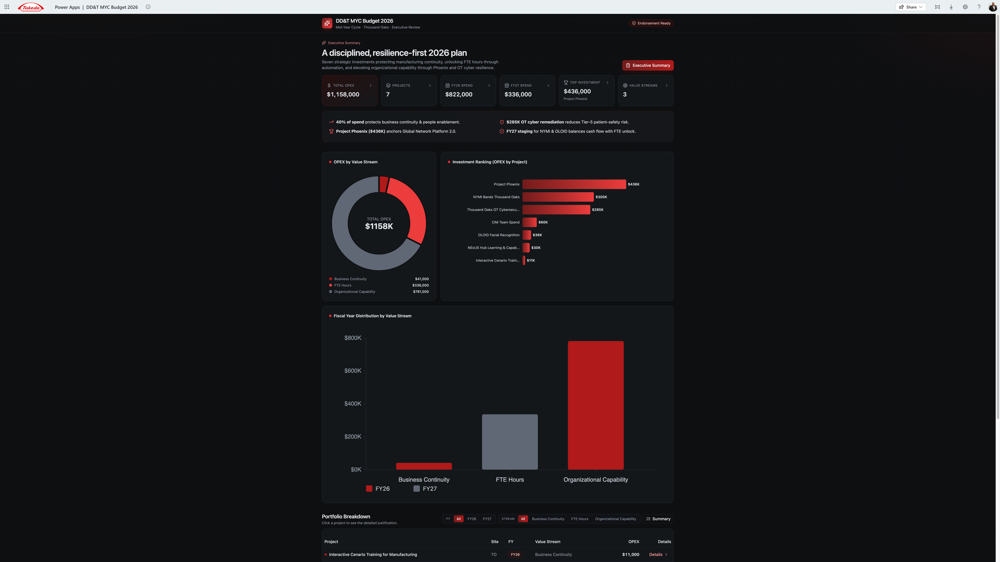

### 3.3 Combined Budget + Gantt Power App (target Gantt tab)

| Item | Value |
| --- | --- |
| Play URL | `https://apps.powerapps.com/play/e/d99720be-f155-e674-86b3-32acc687394e/app/5d55a550-7d80-469a-84bc-bee2f53a08b3` |

The production **Gantt** tab must look and behave like this app: timeline bars and budget/actuals on the same row, not two disconnected screens. Left = site roadmap by workstream (MES, SAIL, Paperless, …) with SPOT IDs on the bars. Right = the MYC Budget executive panel for the same site.

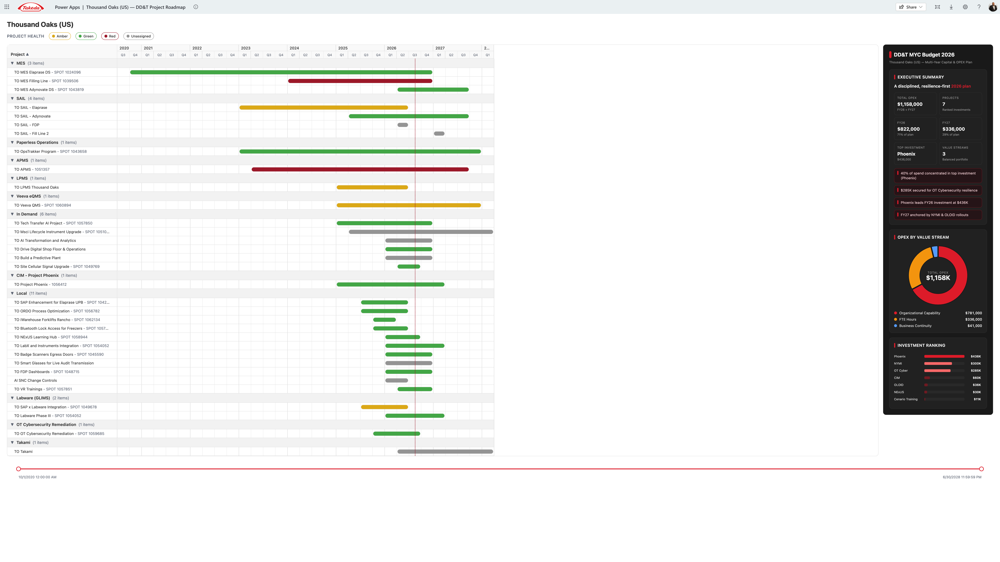

### 3.4 Global DDT Roadmap (network 1,000-foot evidence)

Prototype URL pattern `100.64.0.2:3000` with tabs Overview · Global Roadmap · Initiatives · Regions · Sites · Data. Snapshot as of 31 Aug 2026:

- 34 programmes · 573 projects · 92 at risk
- Timeline FY24–FY30 with per-site go-lives
- Status glyphs: On Track · Monitor Closely · Leadership Attention Required · Blocked Pending Dependency · No Status · Complete · Cancelled
- Programme health is **rolled up from linked projects** (no authored initiative RAG in the feed)
- Site-led work is a first-class lane (329+ items), not hidden

This is the **network** reading of the same portfolio the site Power App shows for one plant. The Executive Platform must be able to show both: one site (business review) and all sites (GSQ leadership). Clicking a site code (THO, LEX, …) sets the Glass site selector.

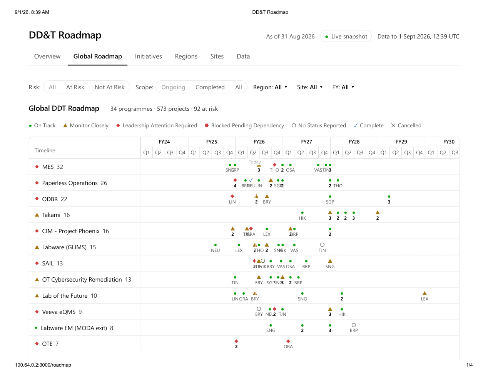

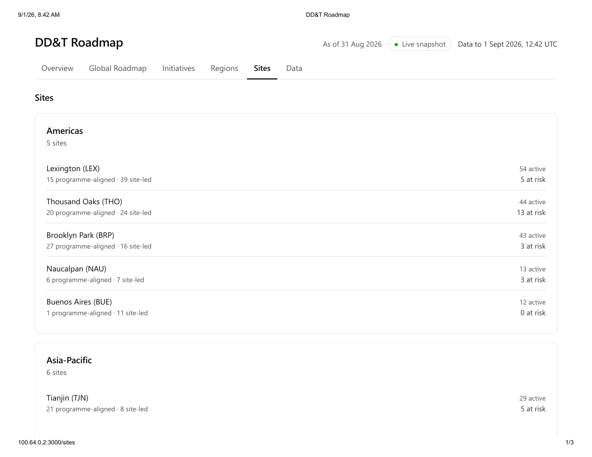

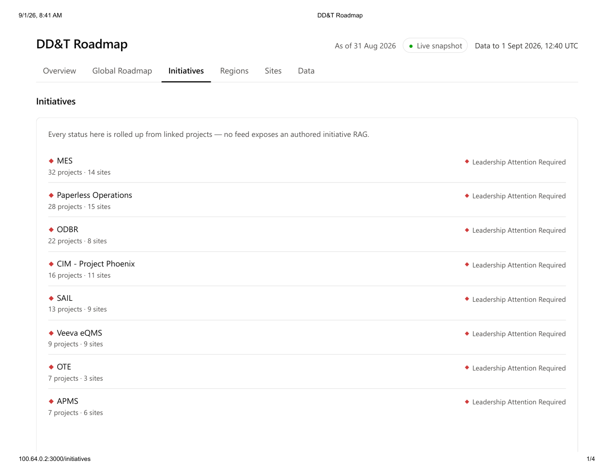

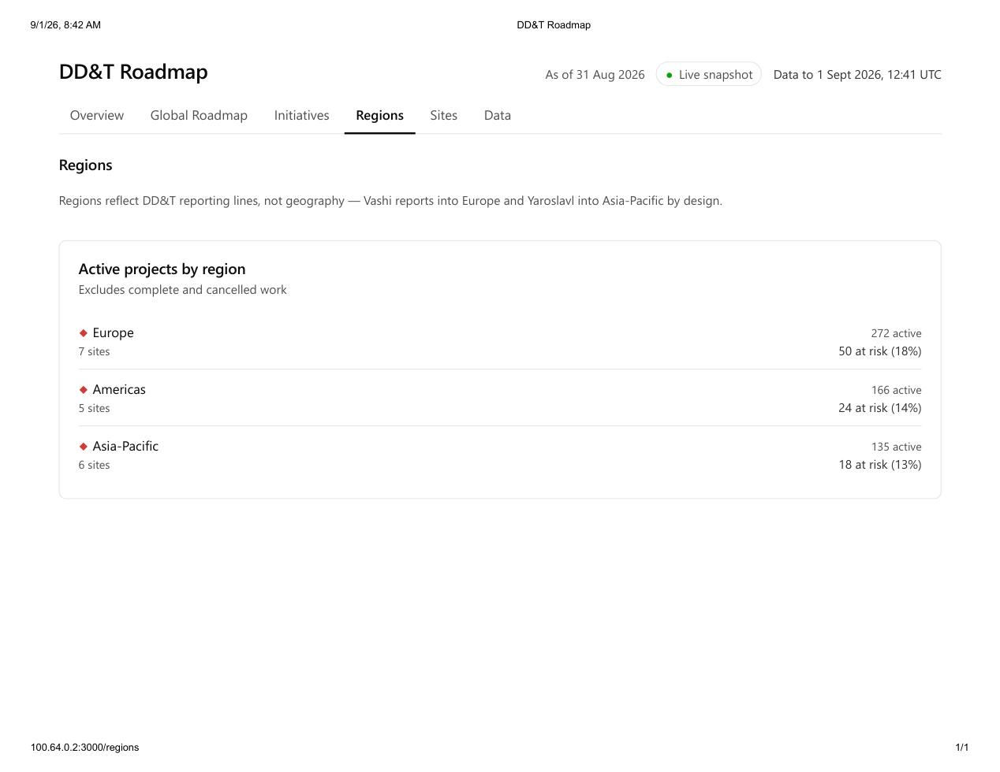

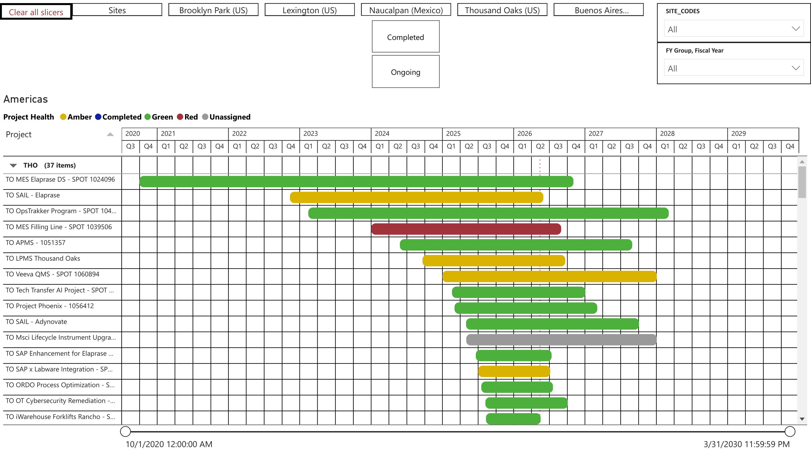

### 3.5 Capability Tracker (Power BI) — North Star / EDB-style drill-down

Two screens exist in `Capability Tracker.pdf`:

**Screen A — plant summary (example: Lexington)**

- Filters: Plant, Global Initiative Yes/No
- Capability KPIs: 48 total · 31.96% deployed · 26.21% adopted
- Integration KPIs: 23 total · 47.83% deployed · 45.65% adopted
- Donuts: Fully Deployed & Adopted / Pending / Deployed, Not Fully Adopted
- Bar: capabilities on a global initiative vs. local
- Footer: SAIL deployed plants (Brooklyn Park, Lexington, Linz, Osaka, Thousand Oaks)

**Screen B — all capabilities (example: Brooklyn Park)**

- Site capability score (49.30) and health line: capabilities complete 29/47 · integrations complete 7/19
- Funnel: Total → Fully Deployed → Fully Adopted → Both
- Pending integrations table (e.g. Batch Release: Floor Scales → LabX, LabWare ↔ MES, MES ↔ SAIL, SAP → RTMS, Veeva ↔ SAP)
- Completed capabilities list

This is the **system-integration and adoption** detail that the 1,000-foot roadmap does not show. The Capability tab embeds this report and passes the Glass plant filter.

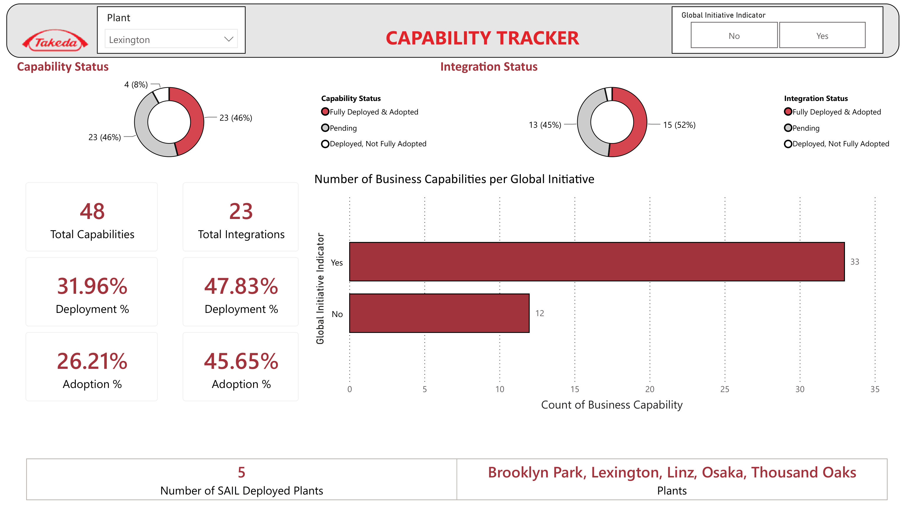

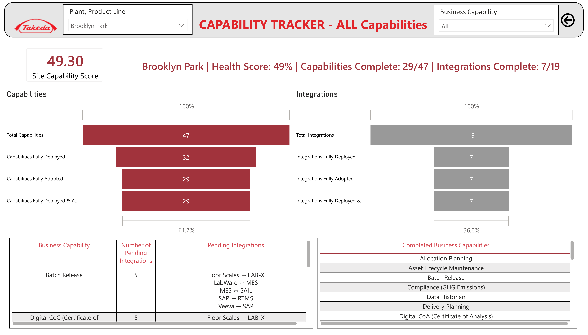

### 3.6 Jira portfolio already in use

`DDTGMPORT` holds the GSQ initiative set (MES, ODBR, Paperless Operations, Takami, Phoenix, Labware, SAIL, OT Cyber, etc.). Site projects (e.g. `DDTTO-*`, `DDTBP-*`) and SPOT IDs (e.g. TO MES Elaprase DS — SPOT 1024096) already exist. That Jira estate is a **data source**, not the delivery Initiative for *this* platform (see the onboarding companion).

### 3.7 What “single pane of glass” means

```
┌──────────────────────────────────────────────────────────────────────────┐
│  EXECUTIVE GLASS  (one Power App / later TakOS shell)                    │
│  Site selector · FY · Big Rock · Platform · Risk · Role                  │
│                                                                          │
│  [One pager] [KPIs] [Gantt+Budget] [Budget] [Risks] [Jira] [Capability]  │
│  [Business Review] [Site input] [Network roadmap]                        │
│                                                                          │
│     embeds / launches existing Power Apps, Power BI, Jira, SPOT          │
│     writes Site Head commentary to Dataverse (system of record)          │
└──────────────────────────────────────────────────────────────────────────┘
         │                    │                     │
    Jira / DDTGMPORT      SPOT investment        EDB / Capability
    delivery + RAG        $ + milestones         deploy / adopt
```

Executives never leave the portal to “find the other dashboard.” Site context set in the header applies to every tab.

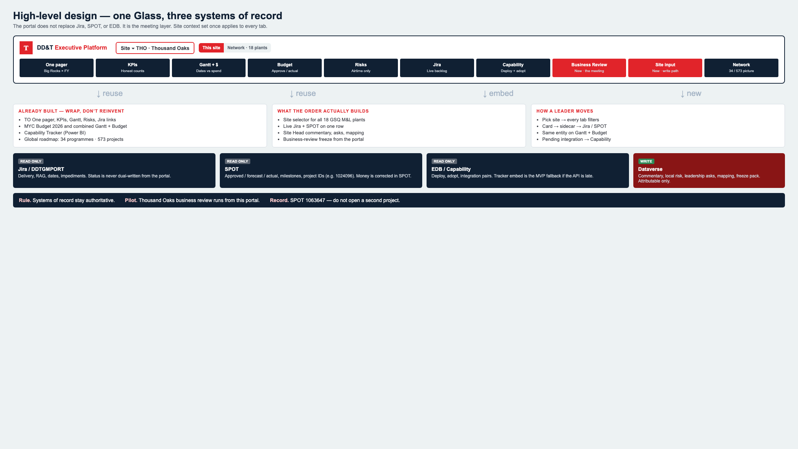

---

## 5. Canonical information architecture

### 5.1 Hierarchy

```
GSQ Network
 └─ Region (Americas / Europe / Asia-Pacific)     ← DD&T reporting line, not geography
     └─ Site (e.g. Thousand Oaks / THO)
         └─ Big Rock (6 strategic capabilities)
             └─ North Star Platform (MES, SAIL, Labware, …)
                 └─ Initiative / Programme (DDTGMPORT-*)
                     └─ Site project (DDTTO-*, SPOT ID)
                         └─ Milestone / go-live
                         └─ Risk / impediment
                         └─ Budget line (SPOT)
                         └─ Capability / integration (EDB)
```

**Reporting-line exception (already in the global roadmap):** Vashi reports into Europe; Yaroslavl reports into Asia-Pacific. The site master must store `reporting_region`, not infer it from country.

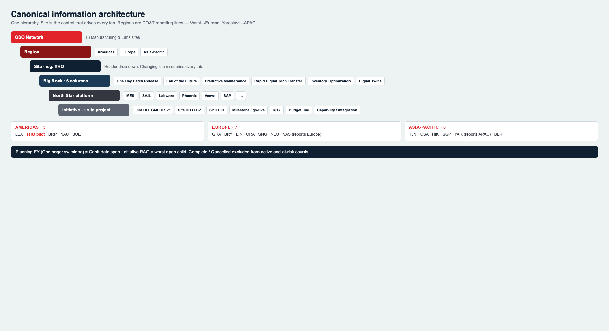

### 5.2 Site master (network of 18)

| Region | Site | Code | Notes for MVP |
| --- | --- | --- | --- |
| Americas | Lexington | LEX | Capability Tracker already live |
| Americas | Thousand Oaks | THO | **Business-review pilot** |
| Americas | Brooklyn Park | BRP | Capability Tracker already live |
| Americas | Naucalpan | NAU | |
| Americas | Buenos Aires | BUE | |
| Asia-Pacific | Tianjin | TJN | |
| Asia-Pacific | Osaka | OSA | SAIL deployed |
| Asia-Pacific | Hikari | HIK | |
| Asia-Pacific | Singapore | SGP | |
| Asia-Pacific | Yaroslavl | YAR | Reports to APAC; high site-led share |
| Asia-Pacific | Bekasi | BEK | |
| Europe | Grange Castle | GRA | Largest site-led volume |
| Europe | Bray | BRY | |
| Europe | Linz | LIN | SAIL deployed |
| Europe | Oranienburg | ORA | |
| Europe | Singen | SNG | |
| Europe | Neuchatel | NEU | |
| Europe | Vashi | VAS | Reports to Europe |

Header control: **Site** (required). Optional second control: **Network / All sites** for GSQ executives. Changing Site re-queries every tab; it does not open a different app.

### 5.3 Six Big Rocks (One pager columns)

| ID | Label | Typical North Star platforms |
| --- | --- | --- |
| `one-day-batch-release` | One Day Batch Release | MES, Veeva eQMS, Smart QC, NYMI |
| `lab-of-the-future` | Lab of the Future | Labware (GLIMS/EM), LabX, Smart QC, SIMCA Online |
| `predictive-maintenance` | Predictive Maintenance | LPMS, RTMS, APMS, COMOS, OpsTrakker |
| `rapid-digital-tech-transfer` | Rapid Digital Tech Transfer | SAIL, Takami, Phoenix |
| `inventory-optimization` | Inventory Optimization | SAP, Takami, warehouse / RTMS |
| `digital-twin` | Power of Digital Twins | Discoverant, Enterprise Data, SIMCA, digital twin use cases |

A project belongs to **exactly one** Big Rock for the One pager (primary). It may tag additional platforms.

### 5.4 Canonical status (must map all three current vocabularies)

| Canonical | TO Power App today | Global roadmap | Power BI | Color / glyph |
| --- | --- | --- | --- | --- |
| `on_track` | On Track | On Track | Green | Green circle |
| `monitor` | At Risk (split) | Monitor Closely | Amber | Amber triangle |
| `leadership` | Delayed / At Risk (split) | Leadership Attention Required | Red | Red diamond |
| `blocked` | — | Blocked Pending Dependency | Red | Solid red |
| `planning` | Planning Not Started | No Status Reported (if no RAG) | Unassigned | Grey hollow |
| `complete` | — | Complete | Completed | Blue check |
| `cancelled` | — | Cancelled | — | Grey X |

**Roll-up rule (already proven on the global roadmap, keep it):**

- Initiative RAG = worst open child project (Leadership > Blocked > Monitor > On Track).
- Do not allow an authored initiative RAG that contradicts children.
- Complete and Cancelled are excluded from “active” and “at risk” counts.

### 5.5 Fiscal time

- Fiscal year labels **FY26, FY27, FY28+** on the site One pager.
- Network Gantt may span **FY24–FY30** (global roadmap already does).
- “Today” marker is required on every Gantt.
- A project’s **planning FY** (One pager swimlane) and **date span** (Gantt start / go-live) are different fields. Do not collapse them.

---

## 6. Target-state mockups (what Band B builds)

These four screens are the **new platform**, not the current Power Apps. Same Takeda chrome on every tab: product title, **site drop-down** (replaces hard-coded Thousand Oaks), This site / Network, source freshness, and the full tab row. Live apps in Figures 1–3 are the visual DNA; these mockups show how that DNA sits in one Glass.

**What changed versus today**

- Site is a control, not a title.
- Tabs add **Budget**, **Gantt + Budget** (replaces thin Gantt), **Capability**, **Business Review**, **Site input**, **Network**.
- Sidecar actions jump inside the Glass (Gantt + Budget, Capability) instead of forcing a second app hunt.
- Business Review and Site input do not exist in the current Power Apps — they are new.

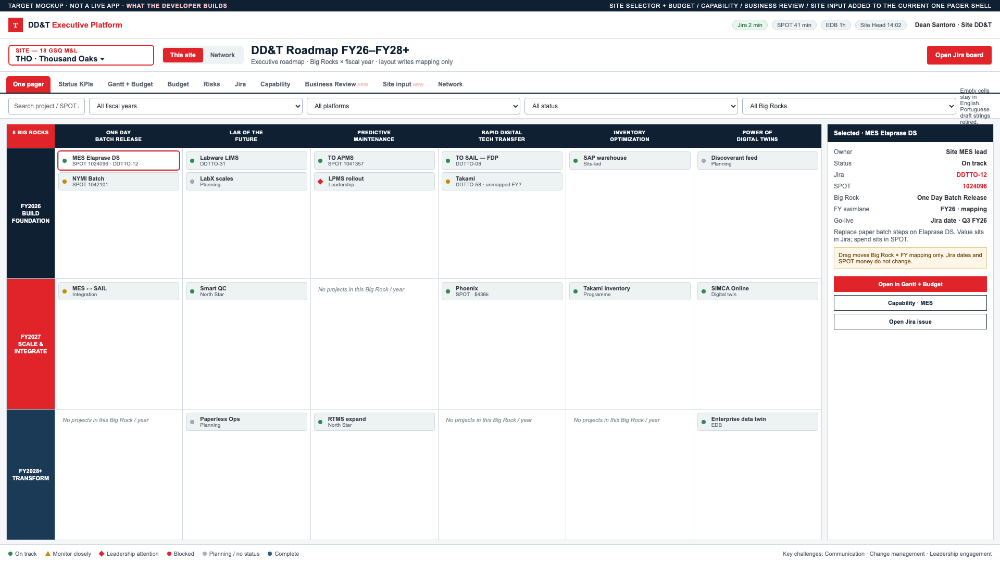

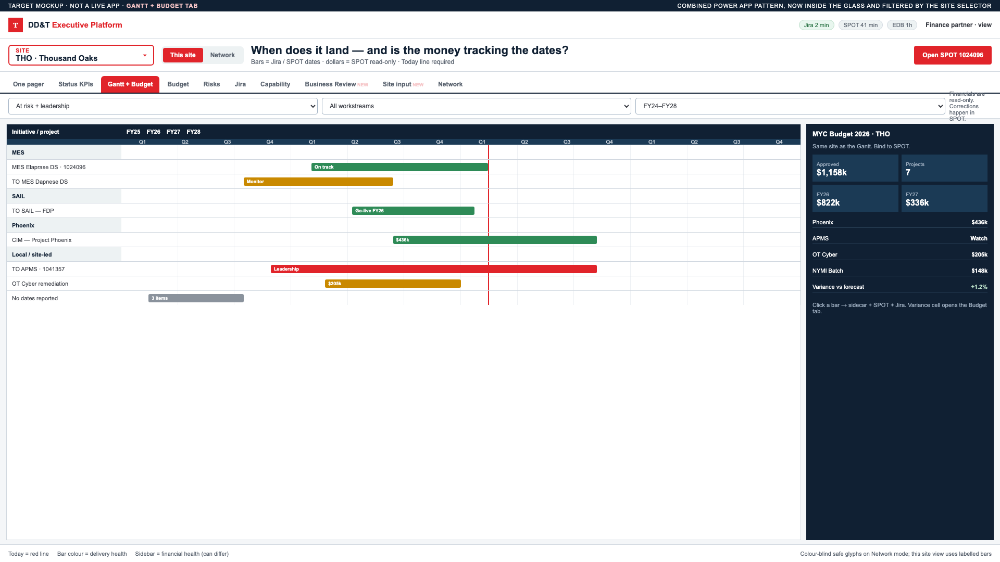

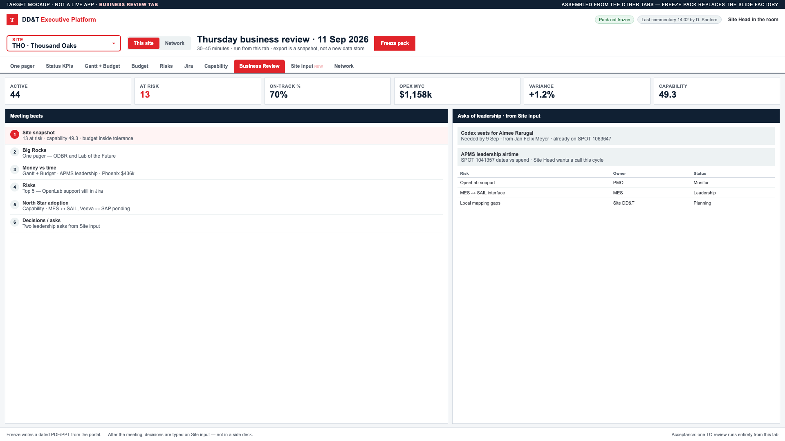

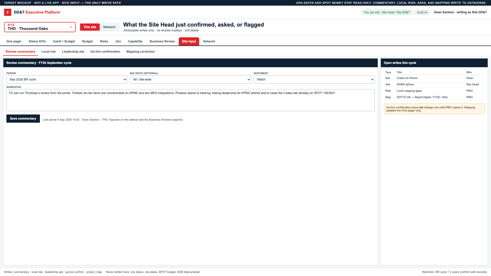

---

## 12. MVP boundary and releases

### 12.1 In MVP (Release 1)

- Site selector across 18 sites (data may be thin outside THO, LEX, BRP).
- All tabs in §6.2 for **Thousand Oaks** with real Jira + SPOT + Capability embed.
- Combined Gantt + Budget and stand-alone Budget.
- Site input + Business Review freeze for TO.
- Network roadmap read-only for executives (may reuse the existing prototype/API).
- EDB path identified and **at least one** capability/adoption view populated for pilot plants (business case: EDB is not deferrable).
- English UX, audit trail, role security.

### 12.2 Out of MVP (Release 2–3)

- Write-back to Jira/SPOT.
- All 18 sites at TO-level mapping quality.
- AI executive briefing / auto-narrative.
- Full Claude Design → TakOS component rebuild of every tab.
- Mobile-native.
- Automated BR deck with video.

### 12.3 Explicit non-goals

- Replacing Jira, SPOT, or EDB.
- Becoming a GxP execution system.
- Pixel-perfect clone of every historical Power BI page.

---

## 13. Level of effort and people-hours

Hours are **delivery hours** (hands on keyboard + workshops + UAT), not elapsed calendar hours. They assume the business design package (this document) is accepted and a developer is funded. They include integration, not just screens.

Rates are **indicative** for a blended Takeda contractor / internal fully-loaded cost of **USD 140 / hour**. Replace with the official Marketplace rate card when the order is placed.

### 13.1 Estimate bands

| Band | What you get | Hours | Calendar | Indicative $ |
| --- | --- | --- | --- | --- |
| **A. Thin shell** | Site selector + wrap existing four tabs + Jira deep links; no SPOT, no EDB, no Site input | 280–320 | 5–6 weeks · 1 FTE | ~$40–45k |
| **B. Recommended MVP** | Band A + Dataverse persistence + Budget + combined Gantt + Site input + TO Business Review + Jira sync + SPOT read + Capability embed | **1,040–1,160** | **10–12 weeks · ~2.4 FTE** | **~$145–162k** |
| **C. Business-case full MVP** | Band B + EDB data-product integration + network roadmap productionized + 3-site capability parity (THO, LEX, BRP) + UAT/hypercare | **1,360–1,520** | **12 weeks · ~3.0 FTE** | **~$190–213k** |

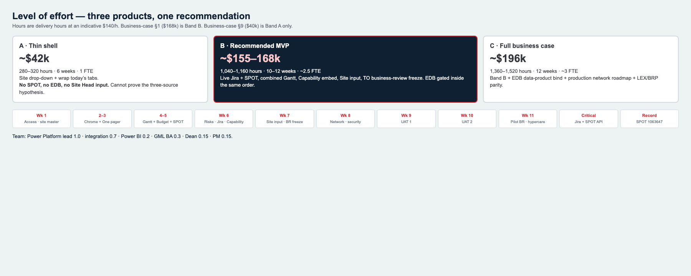

**Alignment to the business case:** Section 1 quotes **~$168k, 6–12 weeks**. Section 9 quotes **~$40k, 6 weeks**. Those are different products. $40k is Band A only and **cannot** validate Jira + SPOT + EDB together. This blueprint recommends **Band B funded at ~$168k**, with EDB treated as a gated workstream inside the same engagement (if the EDB API is late, Capability embed still ships and EDB bind is the last increment).

### 13.2 Work breakdown — Band B (recommended)

| ID | Workstream | Hours | Primary role |
| --- | --- | --- | --- |
| B1 | Kickoff, field workshop, status mapping, site master load | 40 | BA + PMO + Dev |
| B2 | Environment, solution, Entra groups, ALM | 32 | Dev |
| B3 | Dataverse model + audit + security roles | 80 | Dev |
| B4 | Jira connector + staging + status map | 80 | Dev / integration |
| B5 | SPOT connector + financial staging | 64 | Dev / integration |
| B6 | Executive Glass chrome + site selector + filters | 72 | Dev |
| B7 | One pager bound to Dataverse (replace collections) | 80 | Dev |
| B8 | Status KPIs live | 32 | Dev |
| B9 | Combined Gantt + Budget | 96 | Dev |
| B10 | Budget tab | 48 | Dev |
| B11 | Risks + Jira tab | 48 | Dev |
| B12 | Capability embed + plant parameter / RLS | 40 | Dev + PBI |
| B13 | Site input forms + Business Review + freeze | 88 | Dev |
| B14 | Network roadmap hookup (reuse prototype) | 40 | Dev |
| B15 | UX language cleanup, empty/error/stale states | 24 | Dev |
| B16 | Functional test + data reconciliation | 80 | Dev + BA |
| B17 | UAT (TO Site Head + sponsor) + defects | 64 | BA + Dev |
| B18 | Admin guide, 2-week hypercare | 40 | Dev |
| B19 | PM / coordination | 56 | PM |
| **Total Band B** | | **1,104** | |

### 13.3 Add-on to reach Band C

| ID | Workstream | Hours |
| --- | --- | --- |
| C1 | EDB data-product access, contract, first capability/integration views | 120 |
| C2 | Productionize network roadmap (auth, hosting, ops) | 80 |
| C3 | LEX + BRP mapping + capability parity | 48 |
| C4 | Extra UAT / performance / security review | 48 |
| **Band C add** | | **296** |
| **Band C total** | | **1,400** |

### 13.4 Suggested team (Band B, 11 weeks)

| Role | Allocation | Hours |
| --- | --- | --- |
| Power Platform / front-end developer (lead) | 1.0 | 440 |
| Integration / data engineer | 0.7 | 308 |
| Power BI / embed | 0.2 | 88 |
| Business analyst (GML) | 0.3 | 132 |
| Product lead (Dean) | 0.15 | 66 |
| PM | 0.15 | 70 |
| **Total** | **~2.5 FTE** | **1,104** |

### 13.5 Calendar (Band B)

| Week | Outcome |
| --- | --- |
| 1 | Access, site master, Jira field lock, Dataverse first cut |
| 2–3 | Chrome + One pager + KPI on THO live Jira |
| 4–5 | Gantt+Budget + Budget tab + SPOT |
| 6 | Risks, Jira tab, Capability embed |
| 7 | Site input + Business Review freeze |
| 8 | Network view + security + stale states |
| 9 | UAT round 1, data fixes |
| 10 | UAT round 2, admin guide |
| 11 | Pilot BR + hypercare start |

Critical path: **Jira + SPOT API access** (week 1). If either is blocked, the calendar slips one-for-one.

### 13.6 What is *not* in these hours

- Creating a new SPOT project (1063647 already exists), AIDPG Initiative, Pattern-Fit, URS/FDS, or Marketplace order (business / onboarding — see companion).
- New EDB modeling if no data product exists (that is a data-platform initiative; C1 assumes a consumable API).
- Full TakOS Design System rewrite of every screen (add 400–600 hours / Release 2).
- Rolling mapping quality to all 18 sites (Release 2; ~20–30 hours per site of PMO time, not engineering).

---

## 15. Acceptance criteria (MVP)

1. A user with TO Site Head role opens the portal, sees **Thousand Oaks** pre-selected, and can switch to **Lexington** and get a different One pager.
2. One pager, KPIs, Gantt+Budget, Budget, Risks, Jira, Capability, Business Review, and Site input all honor that site.
3. TO MES Elaprase DS shows the same Jira key, SPOT ID, and dates in sidecar, Gantt, Budget, and Jira tab.
4. Budget totals for the pilot site reconcile to SPOT within agreed tolerance.
5. Capability tab for LEX and BRP matches the current tracker after equivalent filters.
6. Site Head can save commentary and a leadership ask; both appear on Business Review; audit shows name and time.
7. Dragging a card on the One pager does not change Jira; it changes `project_map` only.
8. Freshness is visible; a failed Jira sync does not show silent old data as current.
9. One TO business review is completed from the portal; freeze pack stored.
10. Security: a BRP-only user cannot see TO financials.

---

## 16. Dependencies the delivery team will need on day 1

| Dependency | Owner | Needed by |
| --- | --- | --- |
| Power Platform environment + premium licenses | DD&T / IT | Week 1 |
| Entra groups per role × site | IAM + Dean | Week 1 |
| Jira project read (DDTGMPORT + site projects) | Jira admin | Week 1 |
| SPOT API / report access for manufacturing IDs **and** platform SPOT **1063647** | SPOT admin | Week 1 |
| Power BI embed for Capability Tracker | BI owner | Week 2 |
| EDB data-product steward + env | EDB / AI&D | Week 2–3 |
| Site Head (TO) UAT time | Site leadership | Week 9–10 |
| TakOS / Marketplace POD (if that is the funded builder) | Marketplace | After order |

---

