# GSQ DD&T Executive Platform

## TakOS walkthrough — screenshot beside pre-filled values

| Field | Value |
| --- | --- |
| Product | GSQ DD&T Roadmap Executive Platform MVP |
| SPOT | **1063647** — do not create a second project |
| Guide | [takOS Digital Delivery Onboarding](https://landing-page.man.aws.takeda.io/onboarding?view=guide&section=jira) (TOOL-235311; Veeva prevails) |
| How to use | Left = official TakOS step. Right = what to type or attach for this initiative. **Now** = file for Intake. **Later** = after the gate. |
| As of | 8 September 2026 |
| Sponsor / PM | Joel Vincent / Dean Santoro |

Do not treat a screenshot of the onboarding site as a Veeva form. The §22 aid is stateless — copy it into Jira.

### Contents

- [01 · Start & authority](#01-start-authority) — NOW
- [02 · Request Access to AI](#02-request-access-to-ai) — NOW
- [03 · E2E process navigator](#03-e2e-process-navigator) — NOW
- [04 · Initiate](#04-initiate) — NOW
- [04a · SPOT](#04a-spot) — NOW
- [04a1 · Live SPOT 1063647 — Project Board](#04a1-live-spot-1063647-project-board) — NOW
- [04a2 · Live SPOT — General Info](#04a2-live-spot-general-info) — NOW
- [04a3 · Live SPOT — Value Creation](#04a3-live-spot-value-creation) — NOW
- [04a4 · Live SPOT — Budget (funding gap)](#04a4-live-spot-budget-funding-gap) — NOW
- [04a5 · Live SPOT — CAPEX forecast $168k](#04a5-live-spot-capex-forecast-168k) — NOW
- [04a6 · Live SPOT — Project Team](#04a6-live-spot-project-team) — NOW
- [04a7 · Live SPOT — Documents](#04a7-live-spot-documents) — NOW
- [04j1 · Live Jira — open AIDPG](#04j1-live-jira-open-aidpg) — NOW
- [04j2 · Live Jira — search before you create](#04j2-live-jira-search-before-you-create) — NOW
- [04j3 · Live Jira — AIDIN Initiatives board](#04j3-live-jira-aidin-initiatives-board) — NOW
- [04j4 · Live Jira — Create form (not saved)](#04j4-live-jira-create-form-not-saved) — NOW
- [04b · JIRA — agent token (optional)](#04b-jira-agent-token-optional) — LATER
- [04c · Initiative](#04c-initiative) — NOW
- [04d · Epic](#04d-epic) — NOW
- [04e · User Story](#04e-user-story) — LATER
- [05 · Request Access to GIT](#05-request-access-to-git) — LATER
- [06 · Set up the local machine](#06-set-up-the-local-machine) — LATER
- [07 · Design](#07-design) — LATER
- [08 · Discover UX](#08-discover-ux) — LATER
- [09 · Plan](#09-plan) — LATER
- [10 · Build → Operate](#10-build-operate) — LATER
- [22a · Intake aid — Identification & need (TOOL-235299)](#22a-intake-aid-identification-need-tool-235299) — NOW
- [22b · Intake aid — Value & classification](#22b-intake-aid-value-classification) — NOW
- [22c · Intake aid — Urgency, risks, Pattern-Fit](#22c-intake-aid-urgency-risks-pattern-fit) — NOW
- [22d · Intake aid — Evaluation & gate](#22d-intake-aid-evaluation-gate) — NOW
- [23 · Pattern-Fit decision tree](#23-pattern-fit-decision-tree) — NOW
- [24 · Records & controlled documents](#24-records-controlled-documents) — NOW
- [25 · Escalation routes](#25-escalation-routes) — NOW

### Constants (use these everywhere)

| Field | Value |
| --- | --- |
| SPOT ID | 1063647 |
| Name | GSQ DD&T Roadmap Executive Platform MVP |
| Jira project for delivery | AIDPG (not DDTGMPORT) |
| Band | B · ~1,100 hours · 10–12 weeks · ~$155–168k |
| Classifications | GxP No · Criticality Medium · SOX No / Review · PII Low |
| Pattern-Fit | Product track · Custom Build (Glass) + reuse embeds |
| Outcome | Deliver a site-aware GSQ DD&T Executive Platform so leadership can run a Thousand Oaks business review from one portal fed by Jira, SPOT, and capability/EDB data, with Site Head commentary as the only write path. |

---

## 01  Start & authority

*Guide §01 — Begin with the governed delivery path · NOW — file for Intake*

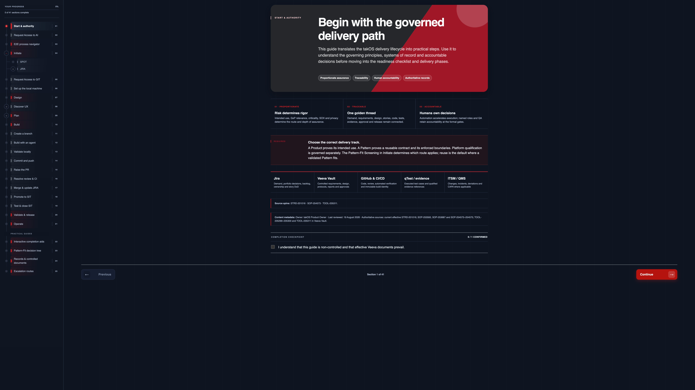

| Field | Enter / attach |
| --- | --- |
| Delivery track | Product — executive portfolio + business review. Pattern-Fit in Initiate confirms the route. |
| Proportionate assurance | GxP No · Criticality Medium · SOX display-only DD&T budget (finance to confirm) · PII Low |
| Golden thread | SPOT 1063647 → AIDPG Initiative → 8 seed Epics → stories/PRs after URS/FDS |
| Accountable humans | Sponsor Joel Vincent · PM Dean Santoro · gate: DD&T Leadership + AI&Data Portfolio Lead |
| Systems of record | Jira = demand/backlog · Veeva = URS/FDS later · GitHub after POD · SPOT = investment |
| Checkpoint | Tick: this guide is non-controlled; effective Veeva documents prevail. |

Acknowledge the guide is non-controlled. Veeva prevails. This initiative is a Product, not a Pattern.

---

## 02  Request Access to AI

*Guide §02 — Required before onboarding (any token-metered tool) · NOW — file for Intake*

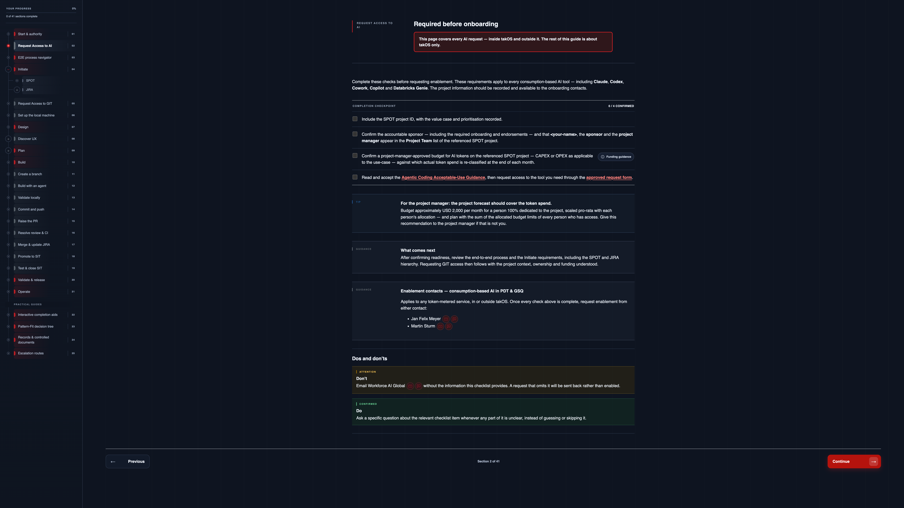

| Field | Enter / attach |
| --- | --- |
| SPOT project ID | 1063647 — GSQ DD&T Roadmap Executive Platform MVP |
| Value case on SPOT | 9,000 h/yr · 18 sites · 42 h/site/month · 30,000 h total · capture 1 Dec 2026 |
| Prioritisation | Active / Plan · Tier 4 · Improvement — General Improvement · COP = Productivity Improvements |
| Sponsor on Project Team | Joel Vincent |
| Project manager on Project Team | Dean Santoro |
| Also on team | Lewis Robinson (Co-PM) · Aimee Rarugal · Juraj Krivda · Simran Karamchandani · Ivan Fonseca |
| Token budget on SPOT | OPEN — add a forecast line. Guide: ~USD 2,000 / month per 100% FTE, pro-rata. Claude tokens already provisioned; close Aimee Codex ask (due 9 Sep 2026). |
| CAPEX vs OPEX for tokens | OPEX unless IAS 38 Development-phase applies (from 1 Jul 2026). PM decides with finance. |
| Acceptable Use + form | Each user: Agentic Coding Acceptable-Use, then https://forms.cloud.microsoft/e/UmDFQhZDjN |
| Ask enablement from | Jan Felix Meyer or Martin Sturm — after the four checks above |

Do not email Workforce AI Global with an incomplete pack. Contacts: Jan Felix Meyer; Martin Sturm.

---

## 03  E2E process navigator

*Guide §03 — Six phases. One continuous state of control. · NOW — file for Intake*

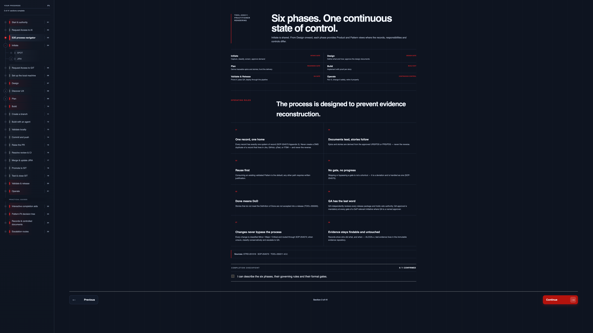

| Field | Enter / attach |
| --- | --- |
| This submission’s phase | Initiate only |
| Closing gate to claim now | Intake Governance Gate — recorded on the AIDPG Initiative Epic (Jira R5). No Veeva duplicate. |
| Shared then split | Initiate is shared. From Design: Product track (this work). |
| Documents lead, stories follow | Do not write a full Ready story backlog before URS/FDS. |
| Reuse first | Embed live Power Apps / PBI. Custom Glass is the shell. |
| No gate, no progress | Do not start Build. Do not file URS/FDS yet. |
| Checkpoint | Tick only when you can name the six phases and this initiative’s current gate. |

Submission closes at the Intake Governance Gate. Do not claim Design Approval or Delivery Readiness.

---

## 04  Initiate

*Guide §04 — Capture, classify, screen, approve demand · NOW — file for Intake*

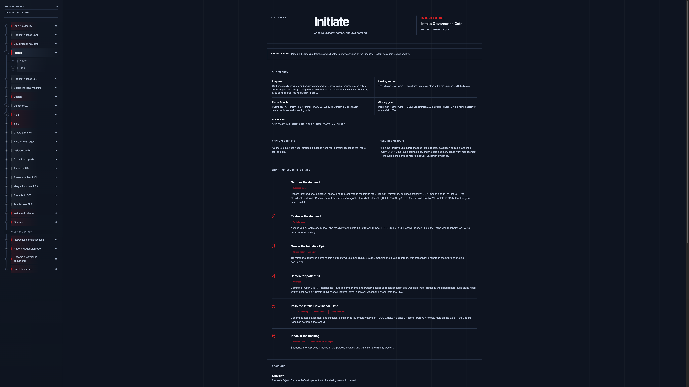

| Field | Enter / attach |
| --- | --- |
| Purpose | Capture, classify, evaluate, approve demand. Pattern-Fit decides Product vs Pattern from Design on. |
| Leading record | AIDPG Initiative (create next). Link “Open in SPOT” → 1063647. |
| Forms / tools | FORM-316177 Pattern-Fit · TOOL-235299 Epic content & classification |
| Gate | Intake Governance Gate — DD&T Leadership + AI&Data Portfolio Lead. QA only if GxP = Yes (it is No). |
| 1 Capture | Business Owner / Dean — paste problem, intended use, scope, four classifications (see §22). |
| 2 Evaluate | Portfolio Lead — Proceed / Reject / Refine. Proposed: Proceed. |
| 3 Create Initiative Epic | DPM / Dean — AIDPG, not DDTGMPORT. |
| 4 Screen Pattern-Fit | Architect — FORM-316177. Path: Custom Build (Glass) + reuse embeds. |
| 5 Intake gate | Named approvers, date, rationale on the Jira R5 screen. |
| 6 Backlog / Design | Only after the gate. Do not skip here. |

Leading record = Initiative Epic in Jira (AIDPG). Everything lives on or is attached to that Epic.

---

## 04a  SPOT

*Guide §04 · SPOT — Begin with the reason the work deserves capacity · NOW — file for Intake*

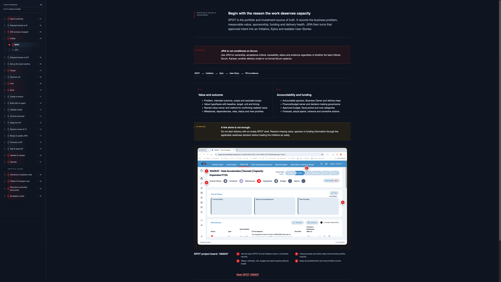

| Field | Enter / attach |
| --- | --- |
| SPOT ID (do not change) | 1063647 |
| Name (keep identical everywhere) | GSQ DD&T Roadmap Executive Platform MVP |
| Board | https://tospot.azurewebsites.net/project-hub/78dd4329-ece5-4796-8cab-776d8ce7af17/project-board |
| What the guide requires | Value, sponsor, ownership, budget, milestones, risks, status — not an empty shell |
| Live record follows | Board · General Info · Value · Budget · Team · Documents |

A link alone is not enough. Do not create a second SPOT. Guide example 1060537 is teaching only. The next pages are the live 1063647 record (captured 8 Sep 2026).

---

## 04a1  Live SPOT 1063647 — Project Board

*SPOT Project Hub · captured 8 Sep 2026 after Takeda sign-in · NOW — file for Intake*

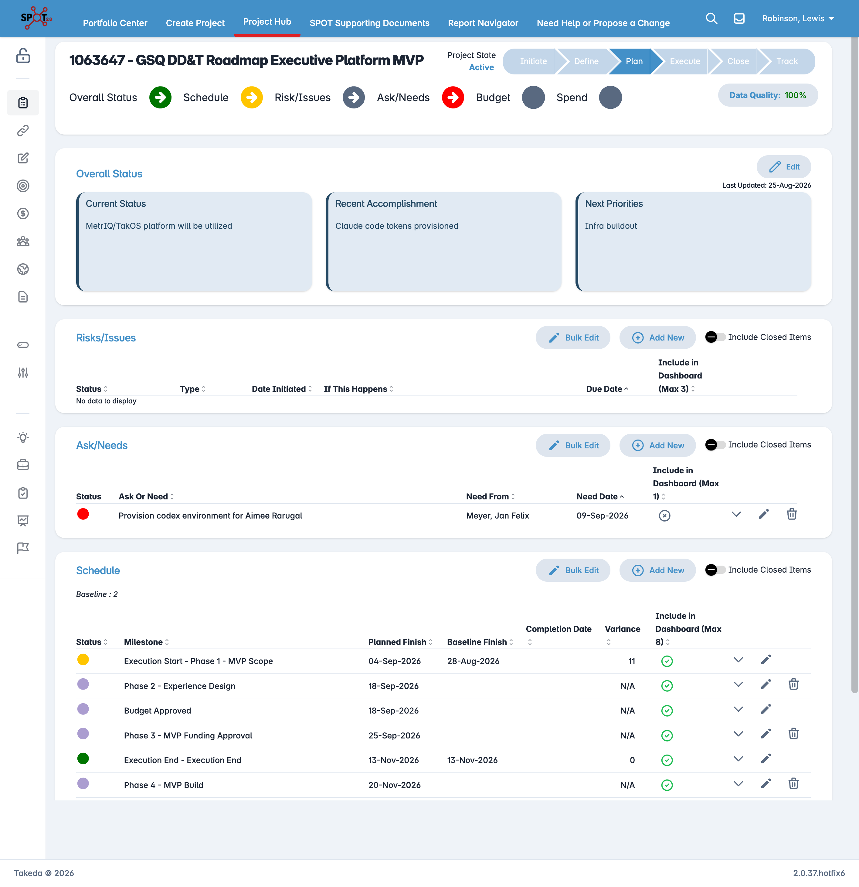

| Field | Enter / attach |
| --- | --- |
| State / phase | Active · Plan · Data Quality 100% |
| Overall status (on record) | MetrIQ/TakOS platform will be utilized. Last updated 25-Aug-2026. |
| Recent accomplishment | Claude code tokens provisioned. |
| Next priorities (on record) | Infra buildout. Change to: AIDPG Initiative + funding request + one CAPEX number. |
| Risks / Issues | Empty — add at least one risk or an explicit “none”. |
| Ask / Need | Provision Codex for Aimee Rarugal · Meyer, Jan Felix · due 09-Sep-2026 · still open |
| Milestones on the board | Phase 1 MVP Scope 04-Sep · Experience Design 18-Sep · Budget Approved 18-Sep · Funding Approval 25-Sep · Execution End 13-Nov · MVP Build 20-Nov · Pilot 11-Dec · Depreciation / Close 22-Jan-2027 |
| Schedule light | Yellow — Phase 1 planned 04-Sep vs baseline 28-Aug (variance 11 days) |

Budget traffic light is red because header CAPEX ($35k) does not match the $168k forecast and there is no funding request.

---

## 04a2  Live SPOT — General Info

*SPOT · General Info. These values already exist — copy them onto the AIDPG Initiative. · NOW — file for Intake*

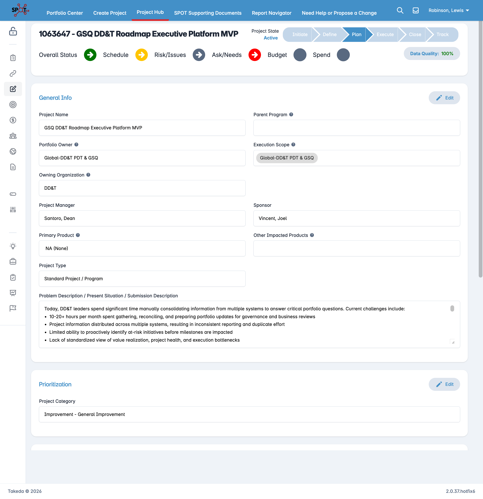

| Field | Enter / attach |
| --- | --- |
| Project Name | GSQ DD&T Roadmap Executive Platform MVP |
| Portfolio Owner / Execution Scope | Global-DD&T PDT & GSQ |
| Owning Organization | DD&T |
| Project Manager | Santoro, Dean |
| Sponsor | Vincent, Joel |
| Project Type | Standard Project / Program |
| Primary Product | NA (None) |
| Project Category | Improvement - General Improvement |
| Governance Tier | Tier 4 - OpU/Global Function LT |
| Record created / submitted by | 25-Aug-2026 · Santoro, Dean |
| Problem (already on SPOT) | DD&T leaders spend 10–20+ hours/month consolidating Jira, SPOT, Power Apps, Power BI and PowerPoint. No single trusted view of delivery, risk, value, bottlenecks or site comparison. |
| Use this on the Initiative | Keep this problem text. Add the intended-use sentence from §22 B2. |

Do not create a second SPOT. If a field here conflicts with the Jira Initiative, change Jira to match 1063647.

---

## 04a3  Live SPOT — Value Creation

*SPOT · Value Creation/Prioritization · NOW — file for Intake*

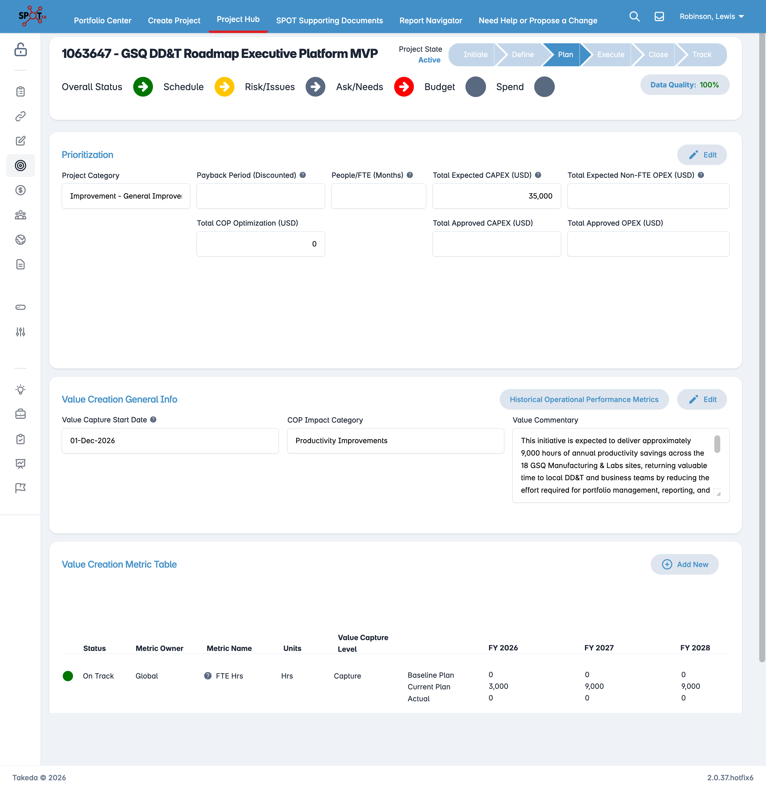

| Field | Enter / attach |
| --- | --- |
| Value Capture Start | 01-Dec-2026 |
| COP Impact Category | Productivity Improvements |
| Value Commentary (on record) | ≈9,000 hours/year across 18 GSQ M&L sites · ≈500 h/site/year · ≈42 h/site/month. |
| Metric | FTE Hrs · Owner Global · On Track · Capture |
| FY26 / FY27 / FY28 plan | 3,000 · 9,000 · 9,000 hours (Actuals all 0) |
| Total Expected CAPEX (header) | $35,000 — WRONG for Band B. Change to ~$168,000. |
| Approved CAPEX / OPEX | Blank — correct until the funding request is approved |
| Total COP Optimization (USD) | 0 — hours are the unit; leave USD at 0 |
| Still write | TO BR-hours baseline method into Value Commentary so realised hours can be confirmed. |

Value case is strong enough to cite. Header Expected CAPEX $35,000 is the number that must be aligned to Band B.

---

## 04a4  Live SPOT — Budget (funding gap)

*SPOT · Budget. CAPEX required. No funding request row. · NOW — file for Intake*

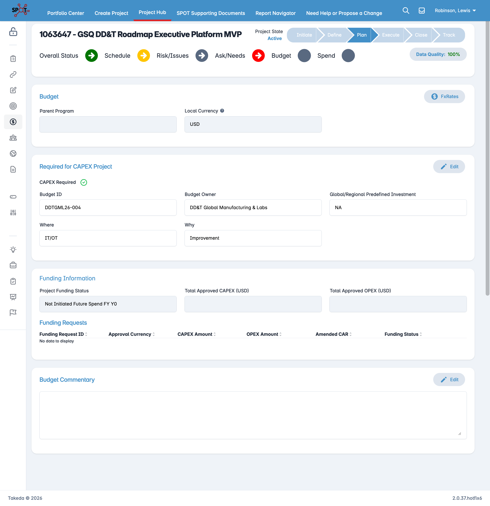

| Field | Enter / attach |
| --- | --- |
| Budget ID | DDTGML26-004 |
| Budget Owner | DD&T Global Manufacturing & Labs |
| Local currency | USD |
| CAPEX Required | Yes |
| Where / Why | IT/OT · Improvement |
| Project Funding Status | Not Initiated Future Spend FY Y0 |
| Funding Requests table | No data to display — FILE the Band B row here |
| Total Approved CAPEX / OPEX | Blank — leave until approved |
| OPEX Required | No / not saved Yes — token line still needed if the POD uses Claude/Codex |
| What to type on the request | CAPEX ~$168,000 · Band B · 10–12 weeks · ~1,100 hours. Reconcile business-case §1 vs §9 to this number. |

This is why the board Budget light is red. File the funding request on this board — do not open a second SPOT.

---

## 04a5  Live SPOT — CAPEX forecast $168k

*SPOT · Budget · Current 2026LBE08 versus Plan 2026LBE02 · NOW — file for Intake*

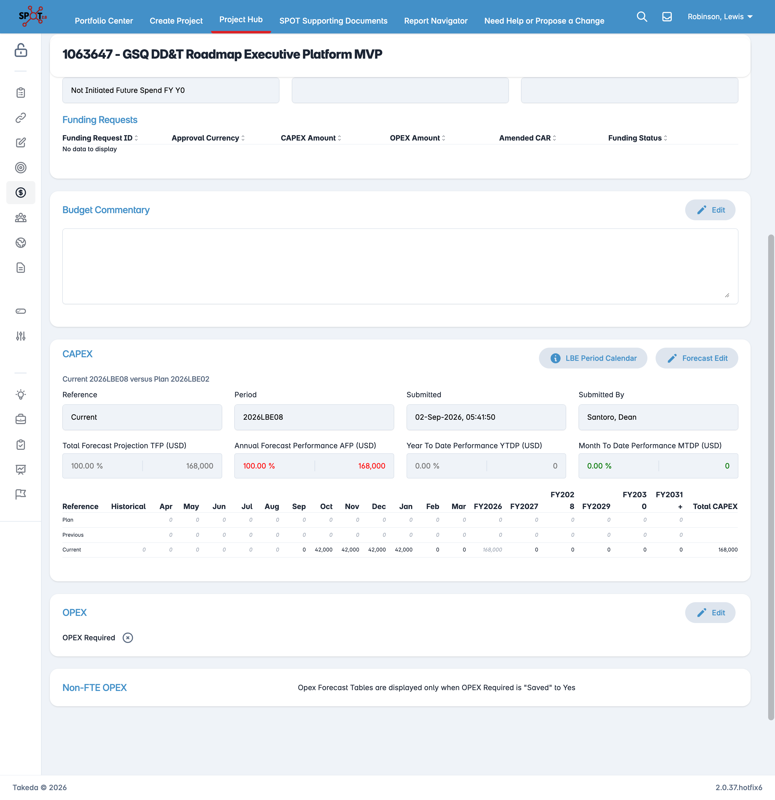

| Field | Enter / attach |
| --- | --- |
| Forecast period | Current · 2026LBE08 · submitted 02-Sep-2026 05:41 by Santoro, Dean |
| Total Forecast Projection | $168,000 (100%) |
| Shape | Oct–Jan $42,000 each · FY2026 $168,000 · later years $0 |
| Plan row | All zeros — only Current carries the $168k |
| Action 1 | Set Value header Total Expected CAPEX from $35,000 to $168,000 |
| Action 2 | Add a Funding Request for $168,000 CAPEX against DDTGML26-004 |
| Action 3 | Add a token forecast line (~USD 2,000 / month per 100% FTE, pro-rata) |
| Do not | Change the forecast down to $35k or $40k — that is Band A and cannot prove Jira + SPOT + EDB |

Dean submitted 2026LBE08 on 02-Sep-2026. Forecast is already Band B. Header Expected CAPEX is not.

---

## 04a6  Live SPOT — Project Team

*SPOT · Project Team. AI and Intake both require sponsor + PM on this list. · NOW — file for Intake*

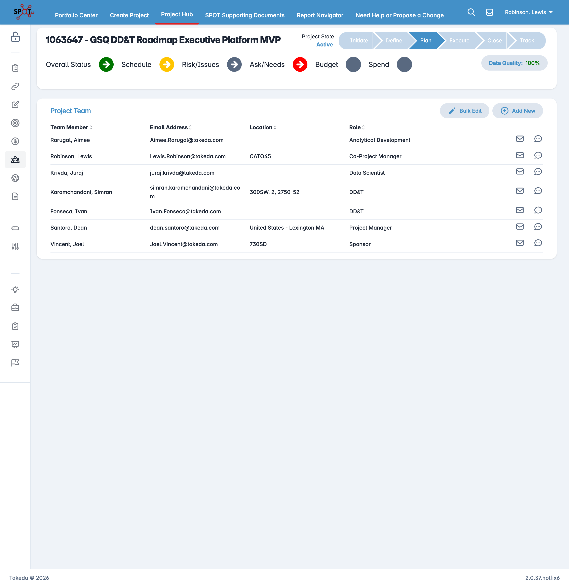

| Field | Enter / attach |
| --- | --- |
| Sponsor | Vincent, Joel · Joel.Vincent@takeda.com |
| Project Manager | Santoro, Dean · dean.santoro@takeda.com · Lexington MA |
| Co-Project Manager | Robinson, Lewis · Lewis.Robinson@takeda.com · CATO45 |
| Also on the team | Rarugal, Aimee (Analytical Development) · Krivda, Juraj (Data Scientist) · Karamchandani, Simran (DD&T) · Fonseca, Ivan (DD&T) |
| AI checklist | Requester + sponsor + PM are on this list. Lewis can be named as requester. |
| Do not add a second sponsor | Joel stays the accountable sponsor. |

Lewis Robinson is already Co-Project Manager on 1063647. Keep him when filing the AI / Intake pack.

---

## 04a7  Live SPOT — Documents

*SPOT · Project Documents. Empty — attach the design pack here after the funding request. · NOW — file for Intake*

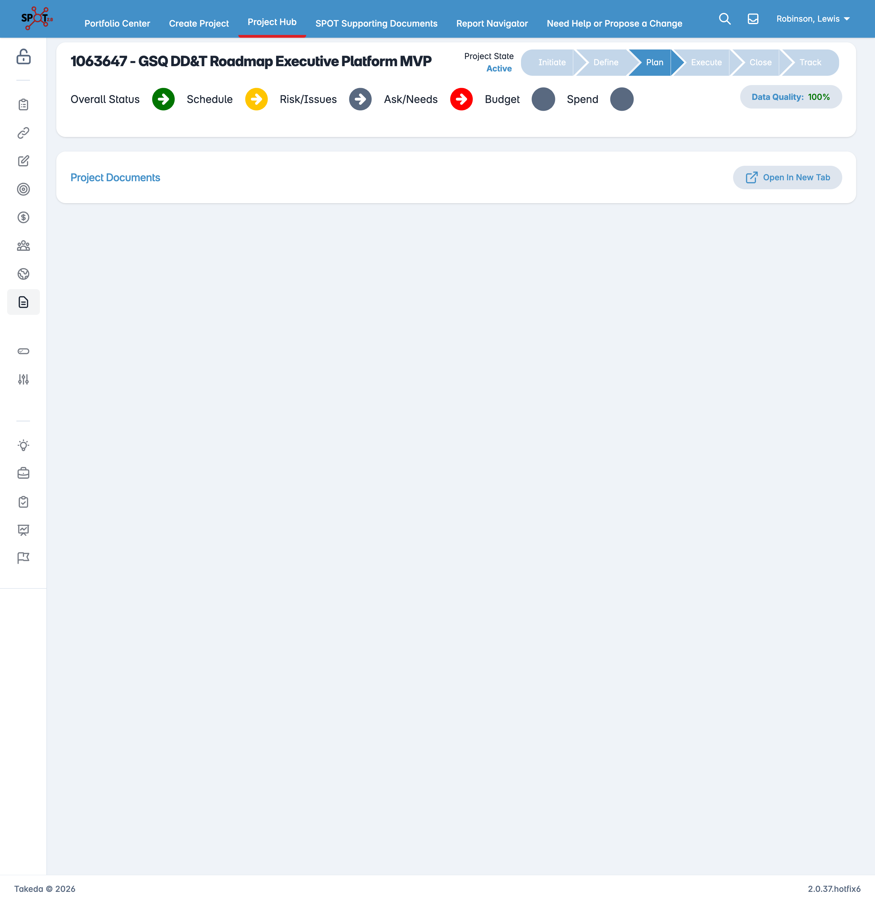

| Field | Enter / attach |
| --- | --- |
| On the tab today | No files — Project Documents pane is empty |
| Attach next | Business case MVP v2 · Design Blueprint · Executive Design · Executive Summary · this walkthrough · Submission checklist |
| After Jira exists | Paste the AIDPG Initiative key in the document comment / board Next Priorities |
| Do not | Upload a screenshot of the takOS website as if it were FORM-316177 |

Use Open in New Tab if the embed is blank. Do not treat this empty pane as “no documents required.”

---

## 04j1  Live Jira — open AIDPG

*onetakeda.atlassian.net · captured 8 Sep 2026 as lewis.robinson@takeda.com · NOW — file for Intake*

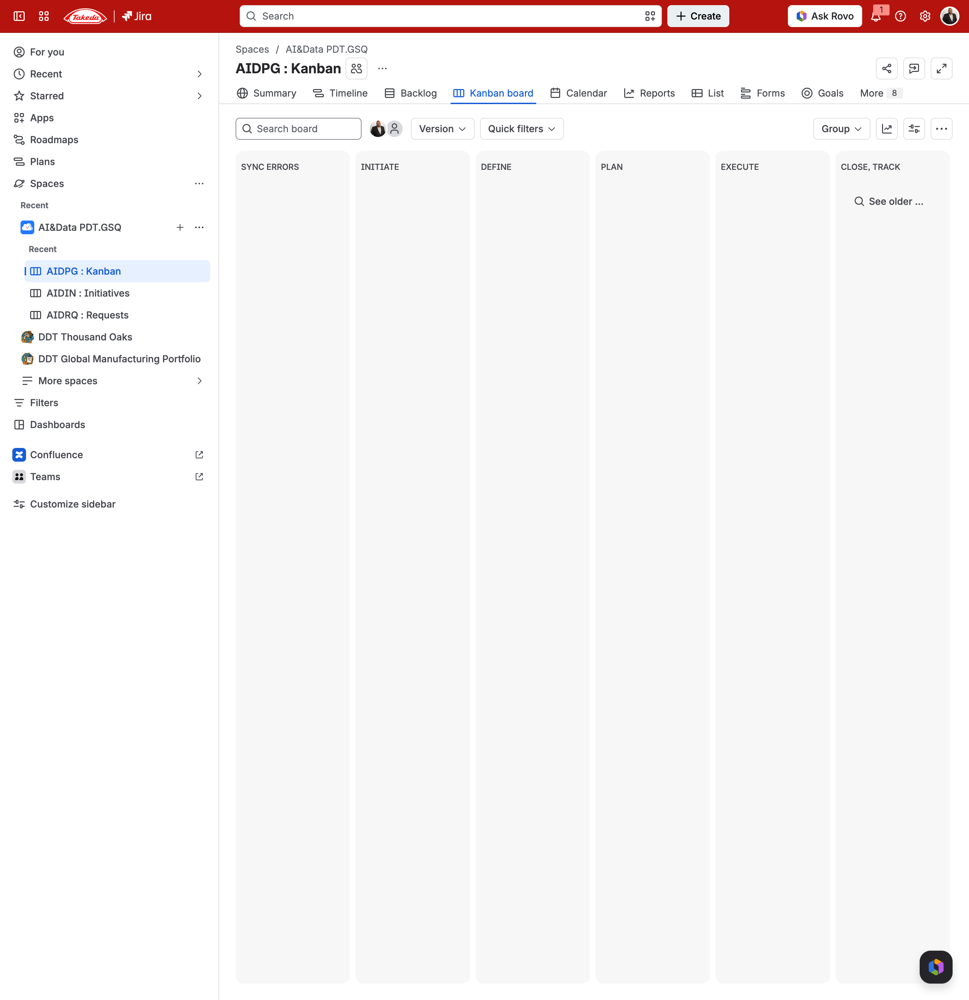

| Field | Enter / attach |
| --- | --- |
| Host (must be this one) | https://onetakeda.atlassian.net — not takeda.atlassian.net |
| Space | AI&Data PDT.GSQ |
| Delivery board | AIDPG : Kanban — https://onetakeda.atlassian.net/jira/software/c/projects/AIDPG/boards/28055 |
| Initiatives board | AIDIN : Initiatives — https://onetakeda.atlassian.net/jira/software/c/projects/AIDPG/boards/28106 |
| Also in the sidebar (do not use for delivery) | AIDRQ : Requests · DDT Thousand Oaks · DDT Global Manufacturing Portfolio |
| AIDPG Kanban today | Empty — Sync Errors / Initiate / Define / Plan / Execute / Close, Track all 0 issues |
| Signed in as | lewis.robinson@takeda.com (Co-PM on SPOT 1063647) |

This is the delivery space. DDTGMPORT stays the manufacturing data source — do not create the Initiative there.

---

## 04j2  Live Jira — search before you create

*Global search · JQL textfields ~ "1063647*" · captured 8 Sep 2026 · NOW — file for Intake*

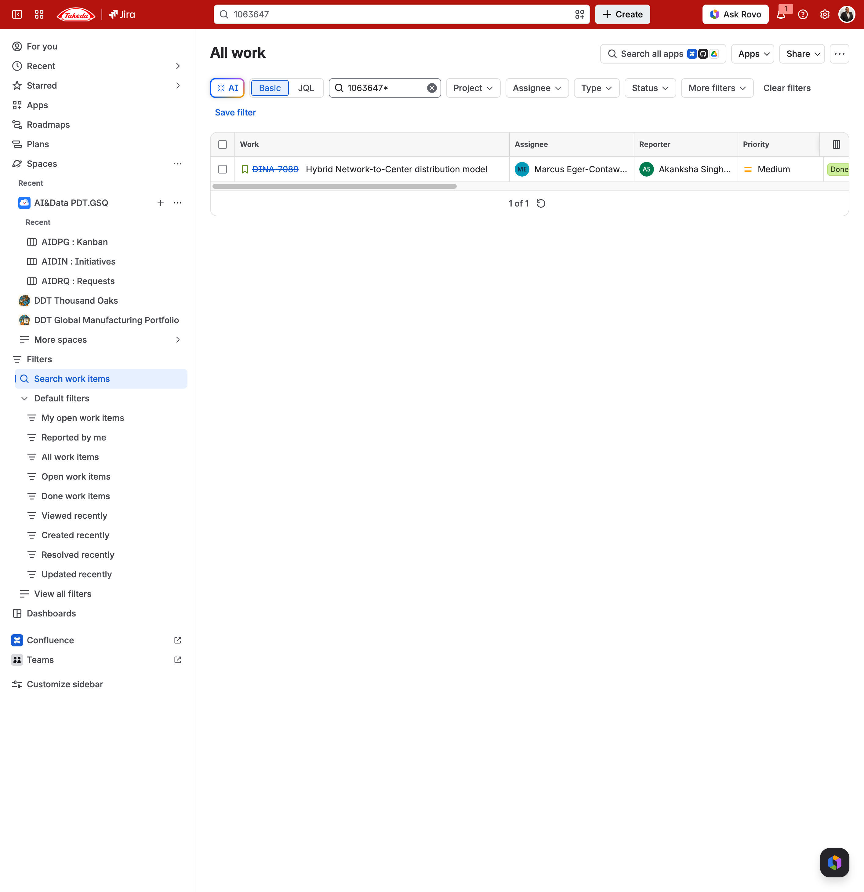

| Field | Enter / attach |
| --- | --- |
| Search string | 1063647 |
| JQL used | textfields ~ "1063647*" |
| Hits | 1 of 1 — DINA-7089 Hybrid Network-to-Center distribution model (Done, DD&T Data Science). Not this work. |
| AIDPG / AIDIN hit? | None |
| Also search before create | "Executive Platform" and the exact summary 1063647 — GSQ DD&T Roadmap Executive Platform MVP |
| Do not reuse | Guide teaching keys AIDPG-4897 (Initiative) and AIDPG-5211 (Epic) |

One unrelated hit. No AIDPG Initiative, no Executive Platform ticket. Safe to create when Dean asks — not a duplicate.

---

## 04j3  Live Jira — AIDIN Initiatives board

*AIDIN : Initiatives · Kanban · captured 8 Sep 2026 · NOW — file for Intake*

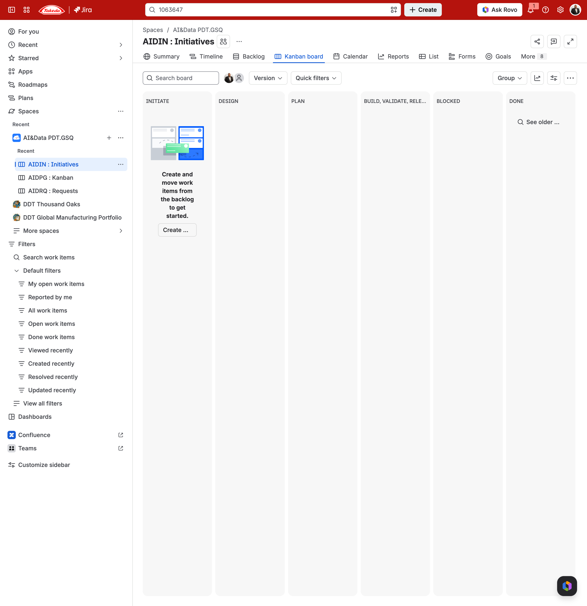

| Field | Enter / attach |
| --- | --- |
| Board | AIDIN : Initiatives (space AI&Data PDT.GSQ; URL path is still /projects/AIDPG/) |
| Columns | Initiate · Design · Plan · Build, Validate, Release · Blocked · Done |
| Counts today | All 0. List tab: “There are no work items here yet.” |
| Where the new Initiative should land | Initiate — leave it there until the Intake Governance Gate |
| Do not | Create a second space or a DDTGMPORT Initiative to fill this board |

Initiatives live on this board, not on the empty AIDPG Kanban. After create, the new card should appear in Initiate.

---

## 04j4  Live Jira — Create form (not saved)

*+ Create on AIDIN · opened 8 Sep 2026 · closed without creating · NOW — file for Intake*

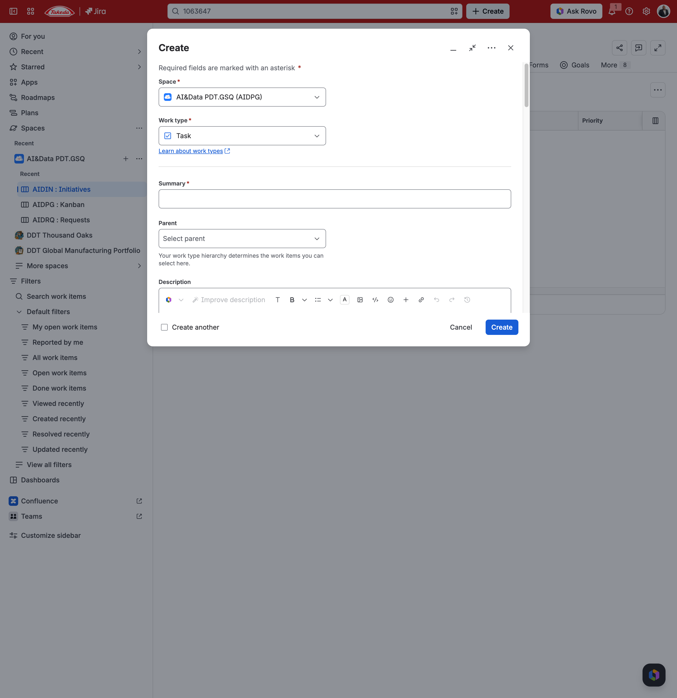

| Field | Enter / attach |
| --- | --- |
| Click | + Create (top bar). Space must stay AI&Data PDT.GSQ (AIDPG). |
| Work type (critical) | Dropdown defaults to Task. Change to Initiative. Do not create a Task. |
| Summary (paste) | 1063647 — GSQ DD&T Roadmap Executive Platform MVP |
| Parent | None — this is the top record |
| Then paste from §04c | Outcome · Open in SPOT · SPOT ID 1063647 · owners · in/out scope |
| Create this record? | Not yet — wait for Dean to say create. This page is the click path only. |
| If you created a Task by mistake | Do not convert in place if fields are wrong. Close it and create an Initiative. |

Form was opened, summary typed, then closed. Nothing was created. Default work type is Task — change it to Initiative before Create.

---

## 04b  JIRA — agent token (optional)

*Guide §04 · JIRA — Drive JIRA from Claude Code and Codex · LATER — after Intake*

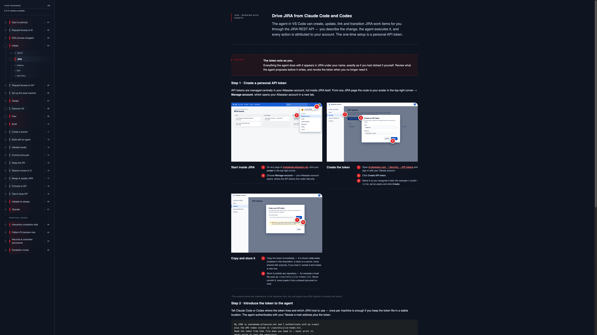

| Field | Enter / attach |
| --- | --- |
| Jira host (must be this one) | onetakeda.atlassian.net — not takeda.atlassian.net |
| Create token | Avatar → Manage account → Security → API tokens → Create API token |
| Token name | dean-santoro-jira (or claude-jira) · set an expiry |
| Store | Local file only, e.g. ~/secrets/jira-token.txt — never repo, chat, screenshot, or this Word file |
| Delivery project | AIDPG for Initiative + Epics. DDTGMPORT is the plant data source only. |
| When to do this | After Intake, if an agent will create/update issues under your name |

Not required to submit Intake. Only if Dean or the POD will let an agent write Jira. Never paste a token into this pack.

---

## 04c  Initiative

*Guide §04 · Initiative — one coherent business or product outcome · NOW — file for Intake*

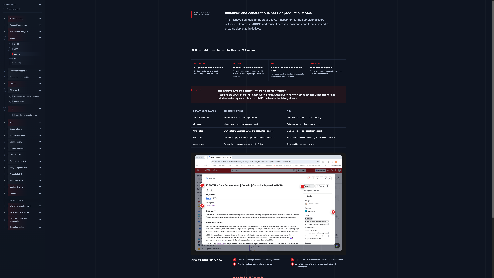

| Field | Enter / attach |
| --- | --- |
| Jira project | AIDPG |
| Issue type | Initiative |
| Summary | 1063647 — GSQ DD&T Roadmap Executive Platform MVP |
| Open in SPOT | https://tospot.azurewebsites.net/project-hub/78dd4329-ece5-4796-8cab-776d8ce7af17/project-board |
| SPOT ID (visible field) | 1063647 |
| Outcome | Deliver a site-aware GSQ DD&T Executive Platform so leadership can run a Thousand Oaks business review from one portal fed by Jira, SPOT, and capability/EDB data, with Site Head commentary as the only write path. |
| Owning team / domain | GSQ GML DD&T |
| Business Owner / Sponsor | Joel Vincent |
| Accountable delivery lead | Dean Santoro (PM) · Lewis Robinson (Co-PM on SPOT 1063647) |
| Included scope | Site selector (18 GSQ M&L sites). Tabs: One pager, KPIs, Gantt+Budget, Budget, Risks, Jira, Capability, Business Review, Site input, Network roadmap. Read-only Jira/SPOT/EDB. Dataverse writes for commentary, local risk, asks, mapping, freeze pack. |
| Excluded scope | Do not rebuild the existing Power Apps. Do not create a second SPOT. No Jira/SPOT write-back. No all-18 mapping quality guarantee. No AI narrative. No GxP execution. DDTGMPORT remains the manufacturing data source, not the delivery Initiative. |
| Dependencies | Power Platform env · Entra · Jira read · SPOT API · PBI embed · EDB steward · Marketplace POD |
| Initiative-level acceptance | TO↔LEX site switch; SPOT 1063647 reconciles; Site Head write + audit; freeze pack; no Jira/SPOT writes from the portal |
| Workflow now | Leave in Draft / Intake until the gate. Do not mark Design. |

Left image is the takOS teaching Initiative (AIDPG-4897) — do not reuse that key. Live search on 8 Sep 2026 found no 1063647 Initiative. Create in AIDPG when Dean asks; change Work type from Task to Initiative.

---

## 04d  Epic

*Guide §04 · Epic — one independently understandable delivery capability · NOW — file for Intake*

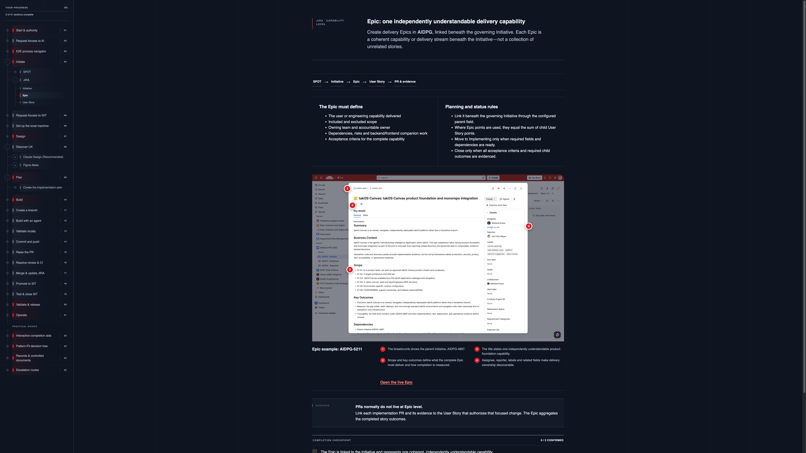

| Field | Enter / attach |
| --- | --- |
| Jira project | AIDPG · parent = the new Initiative |
| Epic 1 | Executive Glass shell and site master |
| Epic 2 | One pager / KPI persistence |
| Epic 3 | Combined Gantt + Budget and Budget tab |
| Epic 4 | Jira inbound sync |
| Epic 5 | SPOT inbound sync |
| Epic 6 | Capability Tracker embed (+ EDB increment) |
| Epic 7 | Site input and Business Review freeze |
| Epic 8 | Security, ALM, UAT |
| Each Epic must carry | Capability · in/out scope · owner · dependencies/risks · acceptance for the whole capability |
| Classifications (on governing Epic) | GxP No · Criticality Medium · SOX Review/No (display-only budget) · PII Low |
| Points rule | Epic points = sum of child stories — leave blank until Plan |
| Move to Implementing | Only after required fields and dependencies are ready — after Intake + Design |

Left image is the takOS teaching Epic (AIDPG-5211) — do not reuse that key. Create the eight seed Epics under the new Initiative after it exists. PRs belong on stories, not Epics.

---

## 04e  User Story

*Guide §04 · User Story — where code, PR and evidence live · LATER — after Intake*

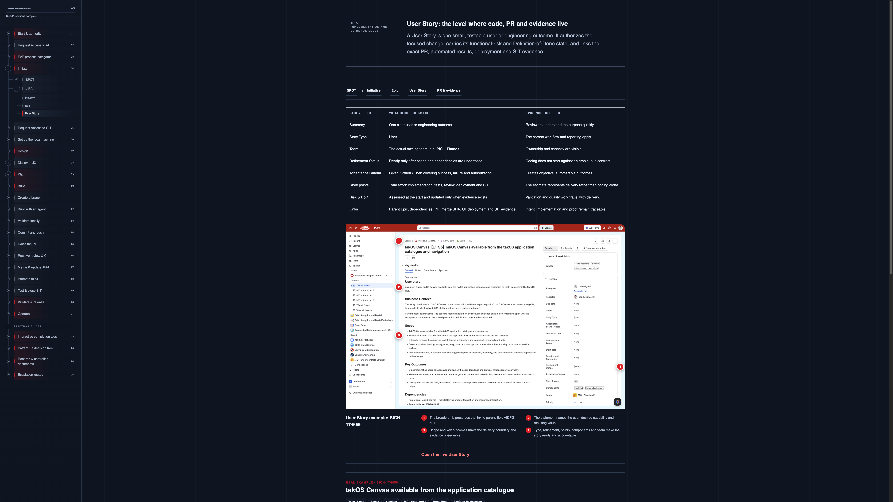

| Field | Enter / attach |
| --- | --- |
| When | Plan phase — after Design Approval Gate |
| Parent | The matching seed Epic, not the Initiative |
| Story Type | User |
| Team | Assigned POD (not yet named) |
| Refinement | Ready only after URS/FDS section-level traceability |
| Acceptance Criteria | Given / When / Then — start from Blueprint §15 MVP tests |
| Example seed (not Ready) | As a Site Head I want to switch the Glass from TO to LEX so the review shows that site’s Jira, SPOT and commentary only. |
| Links later | Parent Epic · PR · merge SHA · CI · SIT evidence |

Do not write a Ready backlog before URS/FDS. Documents lead; stories follow. Guide example BICN-174659 is teaching only.

---

## 05  Request Access to GIT

*Guide §05 — Request access before you build · LATER — after Intake*

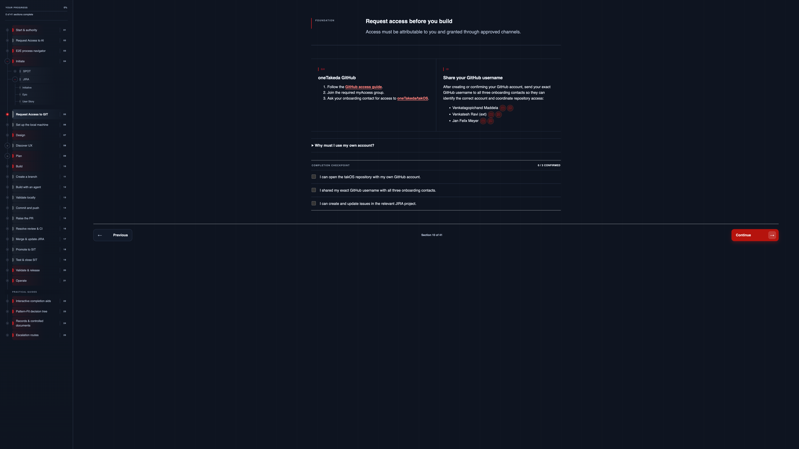

| Field | Enter / attach |
| --- | --- |
| GitHub access guide | myTakeda DevOps — GitHub User Access Guide · join the required myAccess group |
| Repository to request | oneTakeda/takOS (and the assigned delivery repo) |
| Send exact username to | Venkatagopichand Maddela · Venkatesh Ravi · Jan Felix Meyer |
| Jira create rights | Confirm AIDPG (Dean + DPM + future POD) |

After a POD is assigned. Access must be attributable to the person, not a shared account.

---

## 06  Set up the local machine

*Guide §06 — Prepare a reliable local workspace · LATER — after Intake*

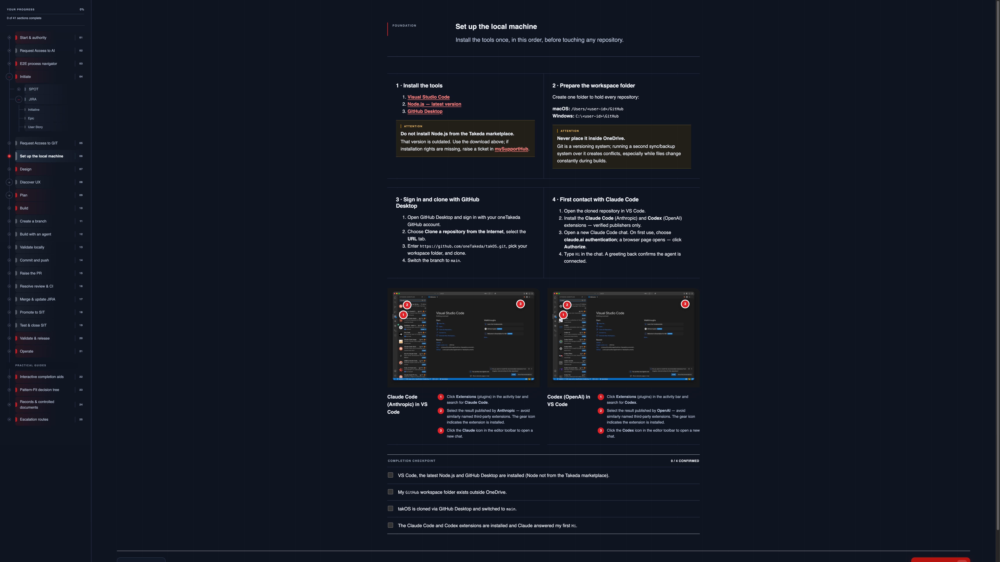

| Field | Enter / attach |
| --- | --- |
| Tools | VS Code · latest Node.js (not marketplace) · GitHub Desktop |
| Workspace folder | macOS: /Users/<id>/GitHub  ·  Windows: C:\Users\<id>\GitHub |
| Clone | Assigned takOS / delivery repo · branch main |
| Extensions | Claude Code (Anthropic) and/or Codex (OpenAI) — verified publishers only |

POD machines only. Do not install Node from the Takeda marketplace. Never put the repo in OneDrive.

---

## 07  Design

*Guide §07 — Define what and how; approve the design documents · LATER — after Intake*

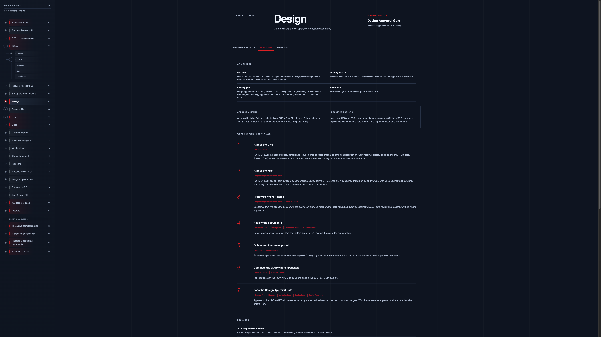

| Field | Enter / attach |
| --- | --- |
| Track | Product |
| Inputs you will already have | Approved Initiative · gate decision · FORM-316177 · this design package |
| URS | Veeva product URS form — content already drafted in Blueprint / Executive Design §§1, 12, 15 |
| FDS | Veeva product FDS form — architecture + embeds + Dataverse write path from Blueprint §§5–9 |
| Prototype evidence already in hand | Live TO One pager, MYC Budget, combined Gantt+Budget, Capability Tracker, target mockups |
| Architecture approval | GitHub PR vs VAL-624698 — after repo exists |
| Do not tell Marketplace | Design Approval is not done. This pack is business URS/FDS content only. |

After Intake. Closing gate = Design Approval. Leading records are Veeva URS/FDS, not this Word pack.

---

## 08  Discover UX

*Guide §08 — Turn a user need into a testable experience · LATER — after Intake*

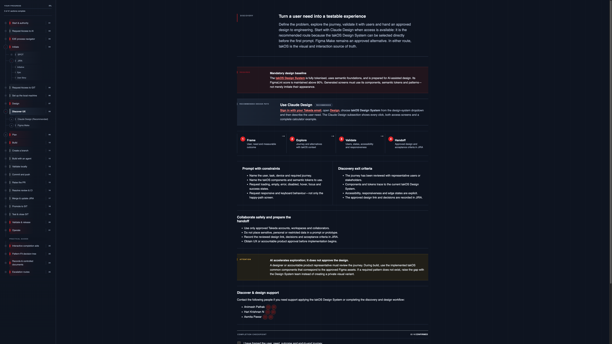

| Field | Enter / attach |
| --- | --- |
| User / need / outcome | Site Head · run the TO BR from one portal · freeze pack without PowerPoint stitch |
| Mandatory baseline | takOS Design System — if designing new screens |
| Recommended path | Claude Design, signed in with Takeda email, design-system pill = takOS Design System |
| Support | Animesh Pathak · Hari Krishnan N · Asmita Pawar |
| Record in Jira | Approved design link + decisions + AC — after Design, not now |

Optional for Intake. Live Power Apps already count as prototype evidence. If a new Glass is designed, use takOS Design System.

---

## 09  Plan

*Guide §09 — Derive traceable epics and stories; fund the delivery · LATER — after Intake*

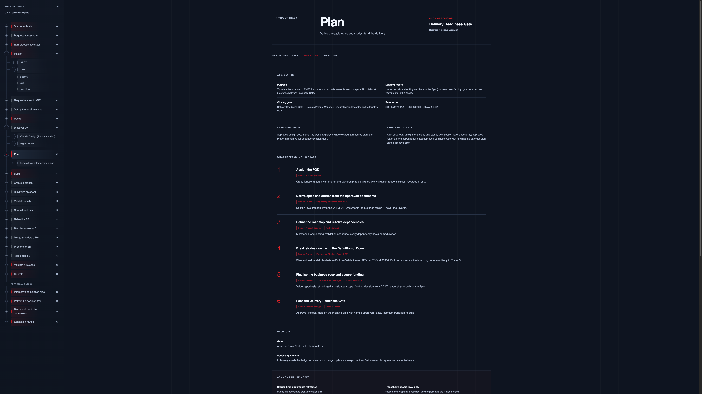

| Field | Enter / attach |
| --- | --- |
| Recommended fund | Band B ~1,100 hours / 10–12 weeks / ~$155–168k |
| Do not fund | $40k Band A — thin shell; cannot prove Jira + SPOT + EDB |
| POD | Marketplace / DD&T — assign after Intake + funding |
| Stories | Section-level traceability from approved URS/FDS — not before |
| Infra questions | Stéphane Dattenny — database, network, secrets, before Build depends on them |
| Gate | Delivery Readiness Gate on the Initiative Epic |

No build before the Delivery Readiness Gate. Fund Band B on 1063647 now; POD assignment is this phase.

---

## 10  Build → Operate

*Guide §§10–21 — Implement with proof per story, then SIT, QA, operate · LATER — after Intake*

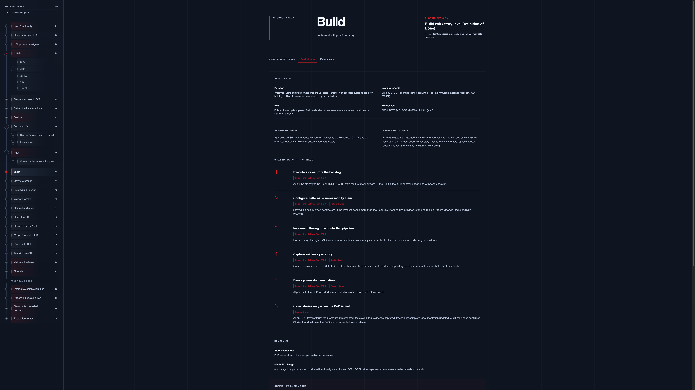

| Field | Enter / attach |
| --- | --- |
| Branch | Named with the authorizing Jira key |
| Patterns | Configure, do not fork. Glass is custom; embeds stay as-is |
| Evidence | CI + immutable repo — not chat attachments |
| SIT / QA / Operate | Promote to SIT · Test & close SIT · Validate & release · Operate — after Readiness Gate |
| Jira updates | Story links to PR, merge SHA, SIT evidence. Epic only aggregates. |

Nothing to file in Veeva during Build. Story DoD is the control. Do not start this path from the funding request.

---

## 22a  Intake aid — Identification & need (TOOL-235299)

*Guide §22 — Interactive completion aids · Initiative Epic Intake & Classification · NOW — file for Intake*

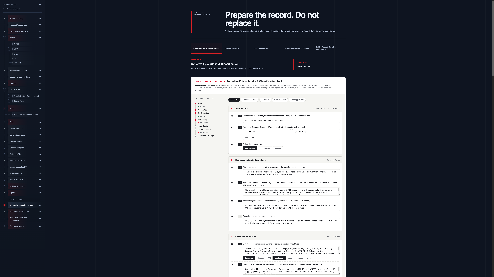

| Field | Enter / attach |
| --- | --- |
| A1 Initiative name | GSQ DD&T Roadmap Executive Platform MVP |
| A2 Business Owner | Joel Vincent |
| A2 Domain | GSQ GML DD&T |
| A2 Product / Delivery Lead | Dean Santoro |
| A3 Request type | New solution |
| B1 Problem | Leadership business reviews stitch Jira, SPOT, Power Apps, Power BI and PowerPoint by hand. There is no single maintained portal for an 18-site GSQ M&L review. |
| B2 Intended use | Site-aware Executive Platform so a Site Head or DD&T leader can run a Thousand Oaks (then network) business review from one Glass: live Jira + SPOT + capability/EDB, Gantt+Budget, and Site Head commentary. Jira/SPOT/EDB stay read-only. Only Dataverse writes: commentary, local risk, mapping, leadership asks, freeze packs. |
| B3 Target users | GSQ M&L Site Heads and DD&T leadership · 18 plants · first UAT: Thousand Oaks |
| B4 Trigger | 2026 GSQ DD&T strategy. SPOT 1063647 is the live investment. Capture start 1 Dec 2026. |
| C1 In scope | Site selector (18 GSQ M&L sites). Tabs: One pager, KPIs, Gantt+Budget, Budget, Risks, Jira, Capability, Business Review, Site input, Network roadmap. Read-only Jira/SPOT/EDB. Dataverse writes for commentary, local risk, asks, mapping, freeze pack. Band B ~1,100 hours / 10–12 weeks / ~$155–168k. |
| C1 Output types | application · dashboard |
| C2 Out of scope | Do not rebuild the existing Power Apps. Do not create a second SPOT. No Jira/SPOT write-back. No all-18 mapping quality guarantee. No AI narrative. No GxP execution. DDTGMPORT remains the manufacturing data source, not the delivery Initiative. |

Stateless aid. Copy into the AIDPG Initiative / Epic. This is not the Jira record. FORM/tool: TOOL-235299 v0.2.

---

## 22b  Intake aid — Value & classification

*Guide §22 — sections D–E (TOOL-235299) · NOW — file for Intake*

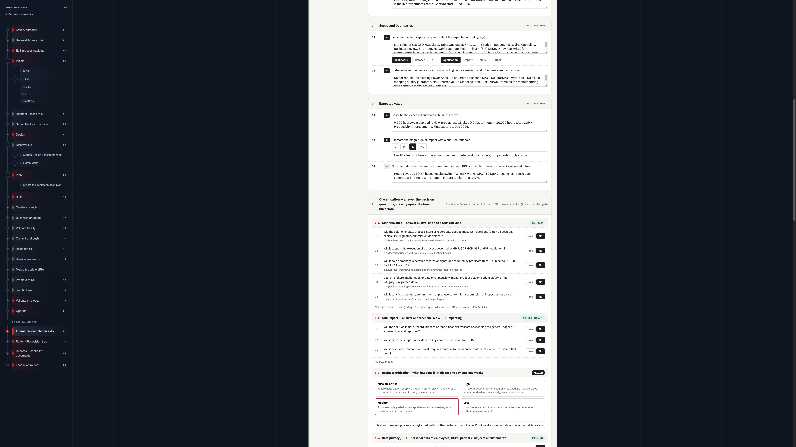

| Field | Enter / attach |
| --- | --- |
| D1 Outcome | 9,000 hours/year avoided review-prep across 18 sites (42 h/site/month). 30,000 hours total. COP = Productivity Improvements. First capture 1 Dec 2026. |
| D2 Magnitude | L — 18 sites × 42 h/month is quantified multi-site productivity; not patient-supply critical |
| D3 Candidate metrics | Hours vs TO BR baseline · TO↔LEX switch · SPOT 1063647 reconciles · freeze pack · Site Head write + audit |
| E-1 GxP Q1–Q5 | No · No · No · No · No → NOT GxP. Portal does not decide batch/clinical/PV; no Part 11; no submission package. |
| E-2 SOX Q1–Q3 | No · No · No → no SOX impact (display-only DD&T budget, no GL). Finance to confirm. Strawman was “SOX Review”. |
| E-3 Criticality | Medium — process degraded; PowerPoint workaround exists; impact in one domain |
| E-4 PII | No — not a personal-data product. Incidental role names only. Strawman: PII Low. |
| E5 Data steward | Not a dataset product. EDB/Capability steward stays with the existing EDB owner; portal is read-only embed. |

Classify upward when uncertain. Reducing a classification later needs documented QA concurrence.

---

## 22c  Intake aid — Urgency, risks, Pattern-Fit

*Guide §22 — sections F–H (TOOL-235299 + FORM-316177) · NOW — file for Intake*

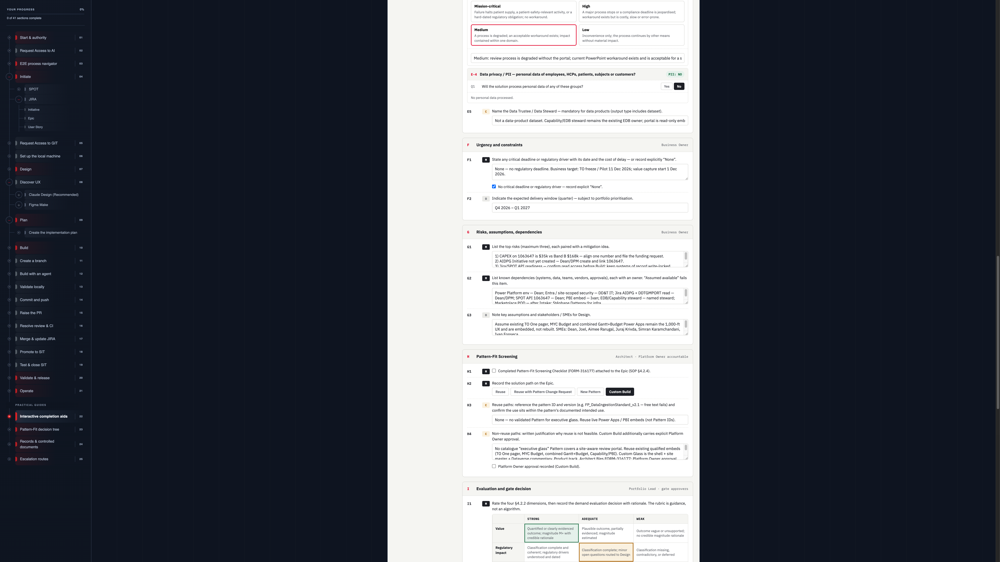

| Field | Enter / attach |
| --- | --- |
| F1 Deadline | None — no regulatory driver. Business target: value capture 1 Dec 2026 · Pilot 11 Dec 2026. |
| F2 Window | Q4 2026 – Q1 2027 |
| G1 Risks (max 3) | 1) CAPEX $35k vs $168k — align and file funding. 2) AIDPG Initiative not created. 3) Jira/SPOT read access before Build. |
| G2 Dependencies + owner | Power Platform — Dean · Entra — DD&T IT · Jira/SPOT read — Dean/DPM · PBI — Ivan · EDB — steward · POD — Marketplace · infra — Stéphane Dattenny |
| G3 Assumptions / SMEs | Reuse TO One pager, MYC Budget, combined Gantt+Budget — embed, do not rebuild. SMEs: Dean, Joel, Aimee, Juraj, Simran, Ivan. |
| H1 FORM-316177 attached | OPEN — Architect completes and attaches to the Epic |
| H2 Solution path | Custom Build (Glass shell) + reuse of live Power Apps / PBI embeds. Product track. |
| H3 Pattern ID | None — no validated “executive glass” Pattern. Embeds are not Pattern IDs. |
| H4 Justification | No catalogue Pattern covers a site-aware review portal. Reuse qualified embeds. Custom Glass = shell + site master + Dataverse commentary. Platform Owner approval required for Custom Build. |

H1 stays unchecked until the architect attaches FORM-316177 to the Epic.

---

## 22d  Intake aid — Evaluation & gate

*Guide §22 — section I + R1–R5. Copy Jira field text; then file the real gate on the Epic. · NOW — file for Intake*

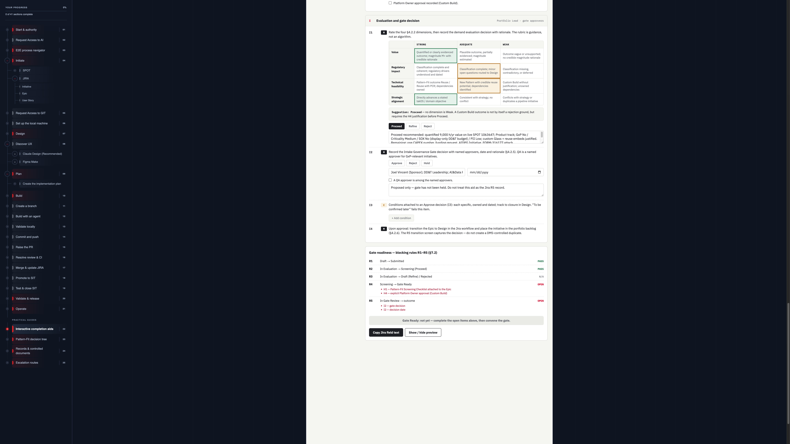

| Field | Enter / attach |
| --- | --- |
| I1 Value | Strong — 9,000 h/yr evidenced on live SPOT 1063647 |
| I1 Regulatory | Adequate — classifications complete; finance confirm SOX; QA not required (GxP No) |
| I1 Technical | Adequate — Custom Build justified; embeds reuse; dependencies named |
| I1 Strategic | Strong — 2026 GSQ DD&T single-pane-of-glass objective |
| I1 Decision (proposed) | Proceed |
| I1 Rationale | Quantified value on 1063647; Product track; GxP No / Medium / SOX No / PII Low; custom Glass + reuse embeds. Still need one CAPEX number, funding request, AIDPG Initiative, FORM-316177. |
| I2 Named approvers (proposed) | Joel Vincent (Sponsor) · DD&T Leadership · AI&Data Portfolio Lead |
| I2 Gate date | Leave blank until the meeting is held |
| I2 QA named? | No — GxP is No |
| I2 / I4 Record | Jira R5 transition on the Epic. No Veeva / DMS copy. |
| R1–R3 | Can reach Submitted / Evaluation once A–G are copied into Jira |
| R4 OPEN | Attach FORM-316177 · Platform Owner approval for Custom Build |
| R5 OPEN | Hold the gate · write Approve/Reject/Hold with date and rationale |

Proposed only. The aid is not the R5 record. R4/R5 stay OPEN until FORM-316177 and the gate exist in Jira.

---

## 23  Pattern-Fit decision tree

*Guide §23 — Reuse is the default. First applicable outcome wins. · NOW — file for Intake*

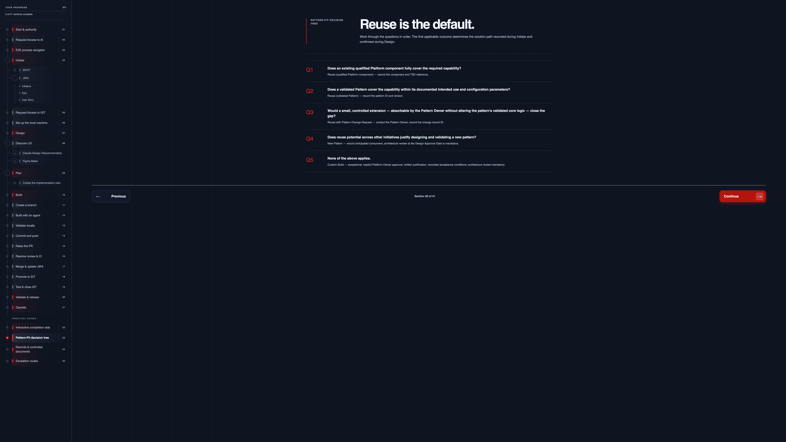

| Field | Enter / attach |
| --- | --- |
| Q1 Qualified Platform component fully covers? | No — no qualified “executive glass” component covers site-aware review + commentary. |
| Q2 Validated Pattern covers intended use? | No — no Pattern ID for this product. |
| Q3 Small Pattern extension closes the gap? | No — Glass + site master + Dataverse writes are not a Pattern tweak. |
| Q4 New Pattern justified by reuse across Initiatives? | No — this is one GSQ DD&T product, not a platform Pattern. |
| Q5 Outcome | Custom Build — exceptional. Written justification + Platform Owner approval + architecture review at Design. |
| What we still reuse | Live TO One pager, MYC Budget, combined Gantt+Budget, Capability/PBI — embeds, not Patterns. |
| Track from Design on | Product |

Work Q1→Q5 in order. Record the path on FORM-316177 and attach it to the Initiative.

---

## 24  Records & controlled documents

*Guide §24 — One record. One home. Pull current copies from Veeva. · NOW — file for Intake*

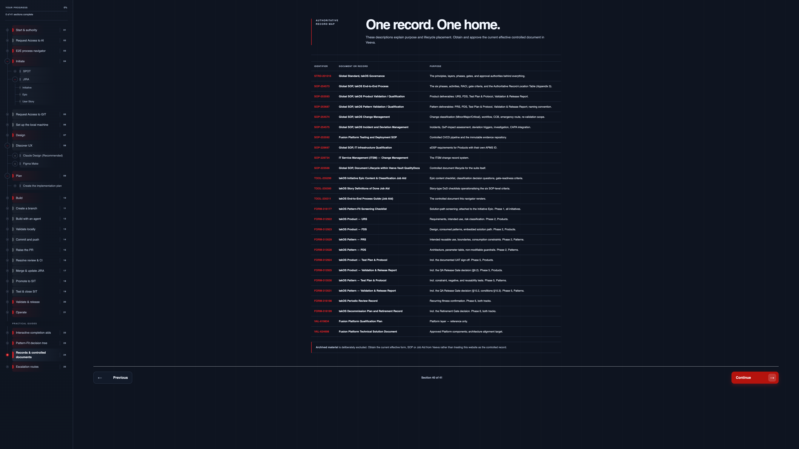

| Field | Enter / attach |
| --- | --- |
| Investment home | SPOT 1063647 |
| Demand / gate home | AIDPG Initiative Epic (SOP-254573 — no DMS duplicate of intake) |
| Pattern-Fit home | FORM-316177 attached to that Epic |
| Classification home | TOOL-235299 fields on the Epic |
| URS / FDS home (later) | Veeva product URS/FDS forms after Intake — not this pack |
| Code / CI home (later) | GitHub |
| This website | Non-controlled. Veeva + Jira + SPOT prevail. |

Do not attach a screenshot of this website as a form. Archived material is excluded.

---

## 25  Escalation routes

*Guide §25 — Resolve uncertainty before the gate. Urgency never bypasses the route. · NOW — file for Intake*

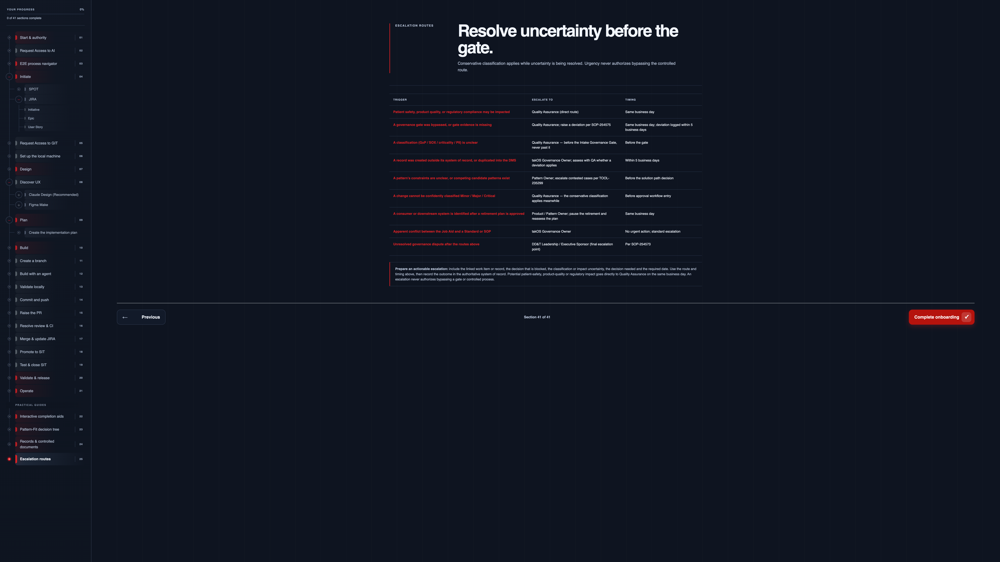

| Field | Enter / attach |
| --- | --- |
| Patient safety / compliance | QA · same business day — not expected (GxP No) |
| GxP / SOX / PII unclear | QA · before the gate — use if finance disputes SOX or commentary looks like PII |
| Pattern constraints unclear | Pattern Owner / Platform Owner · before the solution-path decision — Custom Build needs this |
| Job Aid vs SOP conflict | takOS Governance Owner · not urgent |
| Unresolved dispute | DD&T Leadership / Joel Vincent · per the governing SOP |
| AI enablement | Jan Felix Meyer · Martin Sturm — not Workforce AI Global |
| GitHub / takOS access | Maddela · Ravi · Meyer |
| Infra dependencies | Stéphane Dattenny |
| Jira board / DoD | Ian Leake |

Conservative classification applies while a question is open.

---

## Ordered close-out

1. Reconcile business-case §1 vs §9 to Band B (~$168k).
2. On 1063647: one CAPEX number, funding request, token line.
3. Create AIDPG Initiative; link 1063647; paste the outcome.
4. Create the eight seed Epics.
5. Copy §22 classifications onto the Epic (TOOL-235299).
6. Architect completes FORM-316177 and attaches it.
7. Intake evaluation + Intake Governance Gate on the Epic.
8. File the Marketplace order with the design pack + Initiative key.

Earliest honest “Intake submitted” date: when steps 1–7 exist in Jira/SPOT.
